# 阅读 ClickOS and the Art of Network Function Virtualization

> 论文阅读 / Li Jialin / NUS / CS6101 / NSDI14

NIC: [Network Interface Controller](https://en.wikipedia.org/wiki/Network_interface_controller)

相关: The click modular router

Youtube: Enabling Fast, Dynamic Network Processing with ClickOS, Joao Martins, NEC

https://www.youtube.com/watch?v=IqKDuElBplM&t=685s

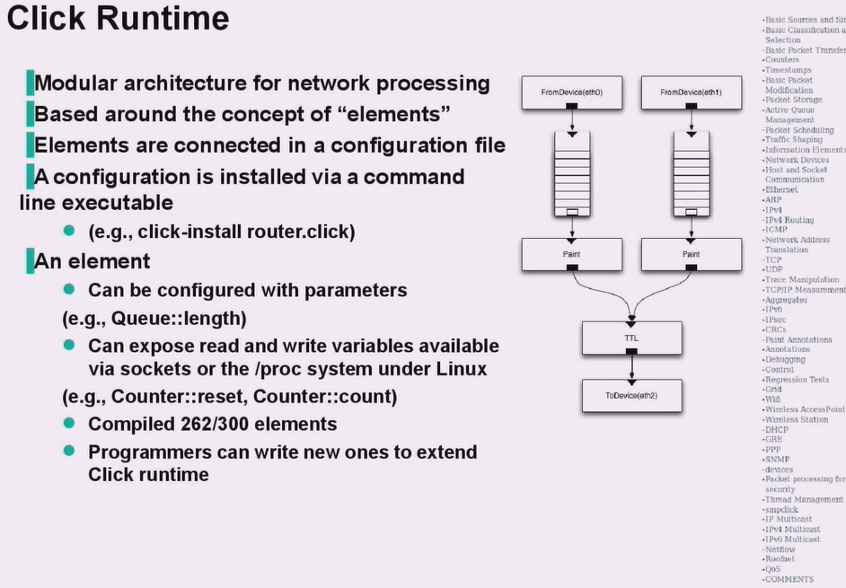

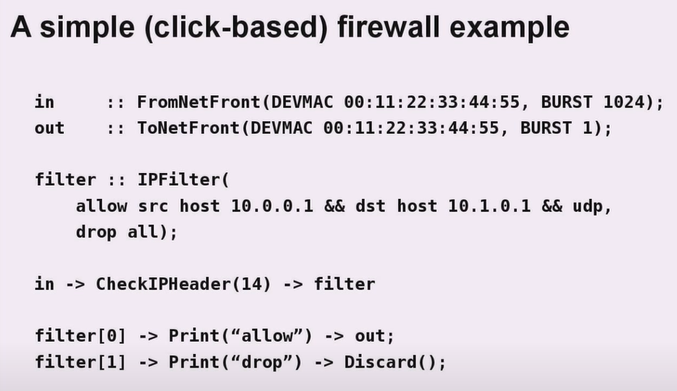

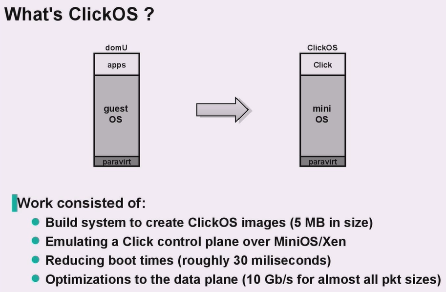

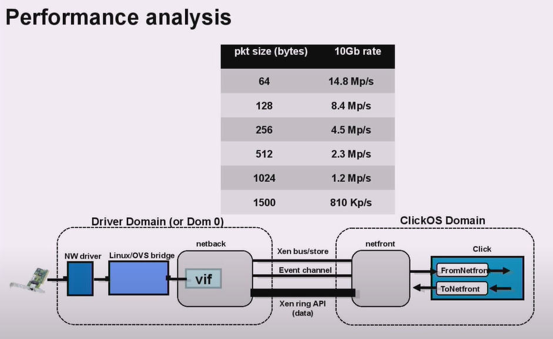

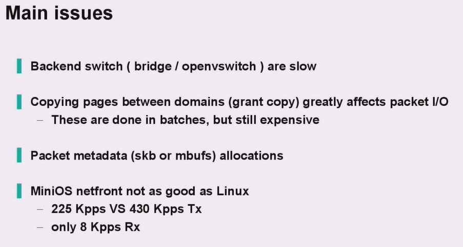

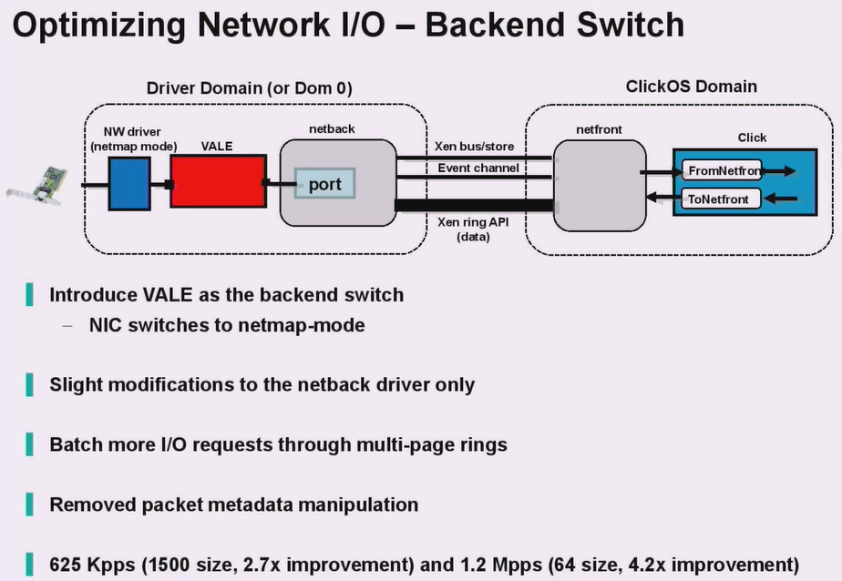

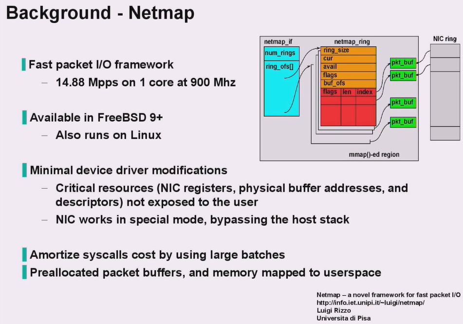

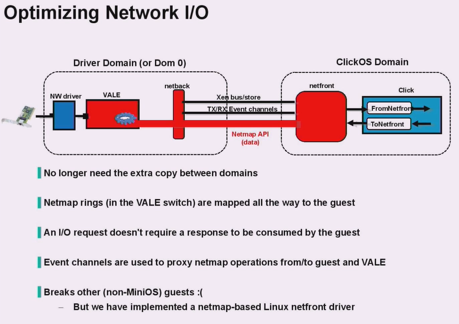

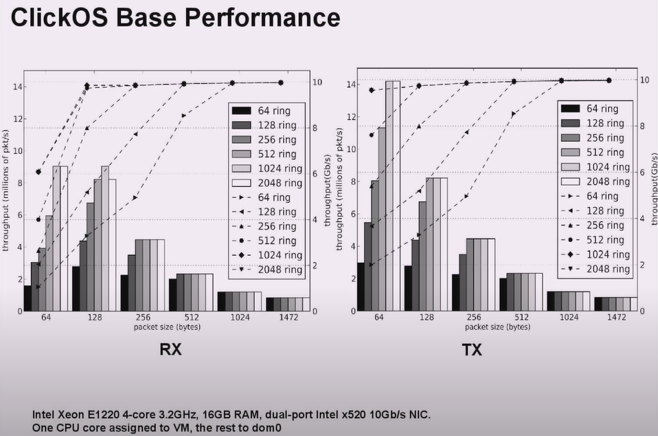

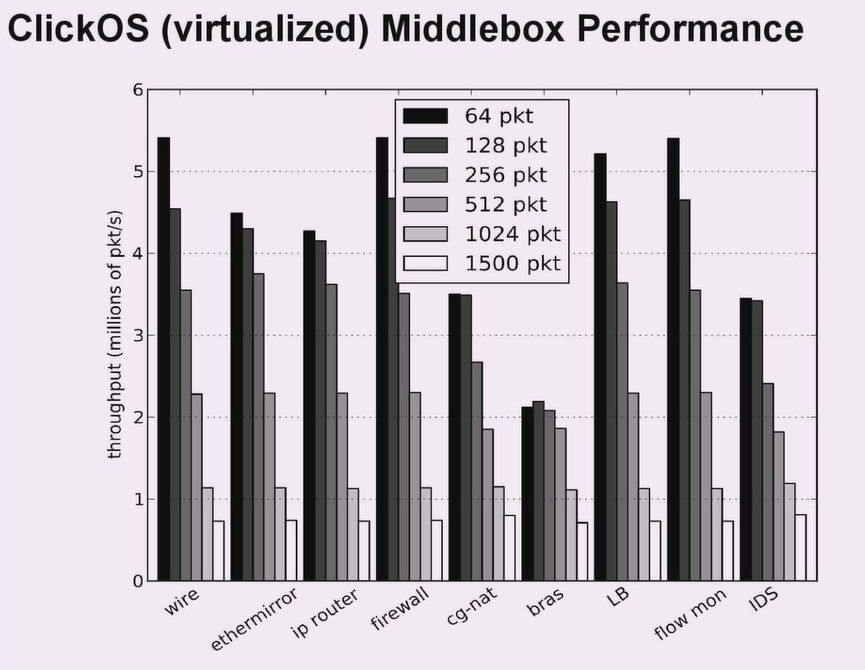

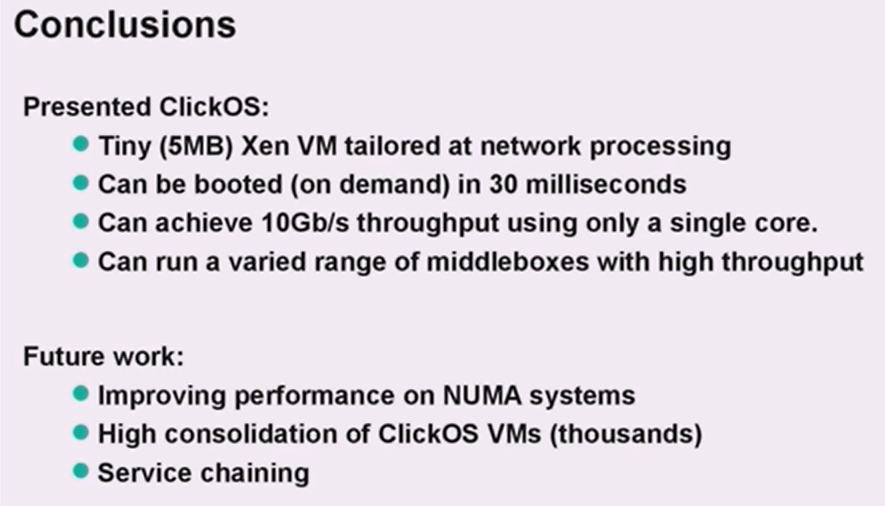