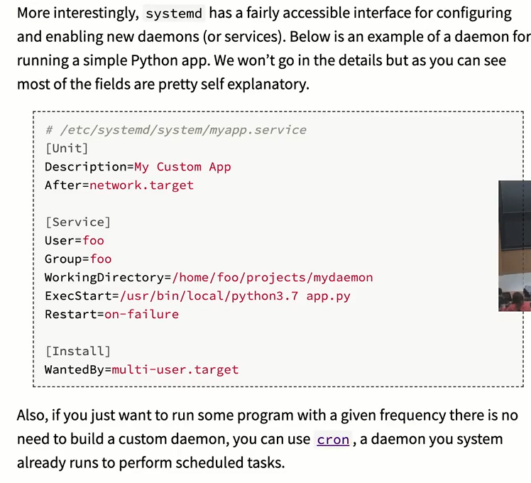
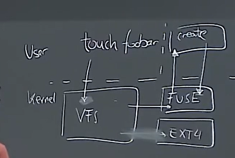

# 笔记 【MIT公开课】6.NULL 你计算机科学教育中遗失的一学期

> b站 / MIT公开课 / CS工具

https://missing.csail.mit.edu/

## Lecture 1

反斜杠可转义空格

```
echo Hello\ World
echo $PATH
which echo
pwd
echo hello > hello.txt
cat < hello.txt
cat < hello.txt >> hello2.txt
ls -l / | tail -n1 > ls.txt
curl --head --silent google.com | grep -i content-length

sudo su

echo 500 > brightness # write to file failed
echo 500 > sudo tee brightness

xdg-open ddd.html

```

## Lecture 2

```
> foo=bar #能work，但是 foo = bar 不能
> echo “Value is $foo” 
value is bar
> echo 'Value is $foo'
value is $foo

$1是第一个参数
$?是上次返回值
$#是参数个数

true || echo "ohh"
false || xxx
true && echo "ohh"

foo=$(pwd)
echo "We are in $(pwd)"

xxx > /dev/null 丢弃

ls *.sh

ls project?

diff <(ls foo) <(ls bar) 比较两个文件夹ls的不同

shellcheck xxx.sh

convert ffmpeg 处理图像视频

tldr 示例帮助命令（需要安装）

find的n种用法，例如 ”**“表示匹配任意个文件夹

history命令，显示命令历史

broot 比tree更好用的查看目录，还有nnn

```

## Lecture 3

- Vim模式
  - normal -i-> insert 
  - insert -esc-> normal
  - replace (r)
  - selection 
    - visual line
    - visual block
  - command line (column)

- Vim命令
  - :sp 分割
  - :q 关闭一个tab
  - :qa 关闭全部
- Vim操作
  - jkhl
  - b和w移动一个word
  - 0 $ 开始和结束的行
  - ^ 第一个非空白字符
  - ctrl D ctrl U 上下
  - G到底，gg到顶
  - f【字母】 找到某个字母
  - F【字母】往前找到某个字母
  - o，在该行下方开新行
  - dw 删除一个word
  - u 撤销
  - de删除单词结尾
  - ce修改单词结尾
  - dd删除整行
  - cc ?
  - x 删除那个字符
  - r【字符】替换一个字符
  - y copy
  - yy copy当前行
  - p粘贴
  - yw复制单词
  - 在Visual mode选择文本
  - 8j 向下移动8行
  - di( 删除括号内的东西
  - da( 删除包括括号在内的东西
  - / 【单词】 搜索单词
  - ci' 修改单括号内的东西
- tmux
- ~/.vimrc 配置

## Lecture 4 (data wrangling)

查一下ssh直接执行远程命令

查一下less (是一个pager程序，分页可滚动)

查一下sed命令

- sed 's/搜索正则/替换正则/'  （进行替换）
  - 默认每行替换一次
  - 在最后+g，表示替换所有（每行也替换多次）
  -  echo 'abcaba' | sed -E 's/(ab)*//g'
  - -E 表示使用现代正则语法
  - ^和$ match整行的开始和结束
  - \1   \2 表示capture group
- regular expressions 101 在线调试期
- wc -l 计算行数
- sort 排序
- uniq -c 只显示不重复的行，打印个数
- awk 每行按column处理文本，可以匹配，逻辑判断。可以print啥的，可以有变量
- paste 查查干嘛的
  - paste -sd+ 可以自动弄成一行，中间加+
- xxx | xargs COMMAND 将前面的输出作为COMMAND的参数
- 管道不只能传文本


## Lecture 5 Command line environment

- to learn
  - Job control
  - Terminal Multiplexers
  - Dot files
  - Remote machines
- man signal 查看所有signal
  - python程序可以import signal, signal.signal来定义handler。
    - 比如定义Ctrl+C的SIGINT
  - SIGKILL不能被handle
  - ctrl+Z suspend
  - jobs命令
  - bg %1
  - kill -STOP %1
  - kill -HUP %1
- tmux
  - concepts
    - sessions: have windows
    - windows: have panes
    - panes
  - tmux new -t footbar
  - tmux ls
  - ctrl+A+prev/next
  - ctrl+A+% 水平分屏
  - ctrl+A+space
  - 远程服务器很有用（即使ssh会话终止,tmux还在运行）
- alias命令
  - alias xx="yyyyy" 设置xx为"yyyyy"
  - alias xx 查询xx是什么
- dotfiles (通常是configuration files)
- dotfiles.github.io/utilities
- symlink
  - ln -s xxx yyy
- ssh可以直接跟要在远程执行的命令
- scp复制文件
  - scp 本地文件 用户@远程地址:远程文件
- 类似工具rsync，和scp一样可以复制，不过支持断点续传
- 如果tmux套娃，本地tmux链接远程tmux，使用不同的快捷键。

## Lecture 6 version control (git)

文件夹叫tree，文件叫blob。

git历史是有向无环图。

- 可以分支可以merge

- 每个commit有author, message

- type blob = array \<byte\>

- type tree = map \<string, tree | blob\>

- type commit = struct E {
    parents: array\<commit\>, 
    author: string, 
    message: string, 
    snapshot: tree}

- type object = blob | tree | commit

- objects = map\<string, object\>

- ```
  def store(o)
  	id = sha1(o) //hash
  	object[id] = o
  def load(id)
  	return object[id]
  	
  为了可读性，
  references = map <string, string>
  给某个commit加可读名称
  ```

- ````
  git init 初始化
  git help init
  git status
  
  git有staging area (下次commit包含什么)
  git add 文件
  git commit 打开编辑器
  git log 查看扁平历史
  git log --all --graph --decorate 查看树历史，还可以加--oneline参数，显示更紧密
  git cat-file -p 哈希    可以查看内部如何保存
  
  git commit -a 提交所有之前跟踪过的文件
  git checkout 哈希   将working directory改变到哪个状态（head指针）
  git checkout 文件   把某个文件恢复到head里的版本
  
  master是最新的commit的可读名称，git log可以看到
  git diff 文件 （将文件与head比较）
  git diff 哈希 文件（将文件与指定commit中的比较）
  git diff 哈希1 哈希2 文件
   
  git branch 列出所有
  git branch -vv 更多信息
  git branch 名称   创建branch
  git checkout branch名称  切换head的分支
  切换到master分支，git merge 分支名
  
  如果提示fastforward，意思是没创建新的commit
  如果conflict，可以配置git mergetool命令，也可以直接打开文件解决冲突。
  
  git add 冲突文件
  git merge --continue 
  
  git remote 列出所有的remote
  git remote add <name> <url> name通常是origin
  git push <remote> <local branch>:<remote branch>
  可以关联分支，不用每次输入对应分支
  git branch --set-upstream-to=origin/master
  直接git push即可
  
  git fetch
  
  git pull可以理解为git fetch + git merge
  也可能会显示fast forward
  
  git clone <url> <foldername>
  
  git clone --shallow
  ````

- ```
  git config
  vim ~/.gitconfig 也可以
  ```

  ```
  git add -p 文件，手动确认文件中的每一处是否提交
  ```

- ```
  git blame 查看每一行啥时候谁提交的
  git stash 暂存，恢复到head
  git stash pop 恢复
  git bisect 二分查找（比如结合unit test，找出unit test停止的第一个commit）
  ```

- ```
  .gitignore文件
  ```

- 可以和shell结合，再shell上就显示git status

## Lecture 7 Debugging and Profiling

- 用不同重要层级的logging, 容易filter, 可以用不同颜色
- linux logs通常在 /var/log
  - lnav 一个查看log的工具
  - journalctl 读取log工具
  - logger 消息    # 将消息记录到system log
- python -m ipdb xxx.py   调试python
  - l    list code
  - s   step
  - c    continue
  - p 变量名      打印变量名
  - q    退出
  - b 行号      断点
  - p locals()      打印所有local变量
- gdb   (low level)
- strace
  - sudo strace ls -l > /dev/null
    - 查看ls -l的所有system call
- 静态分析
  - python
    - pyflakes 文件名   比如检查redefinition, undefined vars
    - mypy 文件名
    - 这些工具能和editor集成
  - 英语检查writegood   2333
- timing
  - real time, user time, system time
  - 直接用time命令，就可查看上述3个
- profilers
  - tracing / sampling
  - python有-m cProfile
  - python -m cProfile -s tottime xxx.py | tac
    - tac将输出反转
  - line profiling
    - 很多语言支持，python的做法是给函数加@profile装饰器
    - 然后用kernprof -l -v xxx.py
  - memory profiling
    - python -m memory_profiler xxx.py
    - C用Valgri
  - 查看page fault，指令数，跳转数等
    - sudo perf stat 命令
    - sudo perf record 命令
  - 可视化
    - 火焰图，call graph (例如python call graph)
- 实时查看状态
  - htop
- 文件大小
  - du -h .
  - ncdu .   可以navigate
  - LSOF    查看list of open files
- benchmark
  - hyperfine，统计一个命令的平均执行时间等

## Lecture 8: Metaprogramming

Build systems

makefile:

```makefile
paper.odf: paper.tex plot-data.png
	pdflatex paper.tex

plot-%.png: %.dat plot.py
	./plot.py -i $*.dat -o $@
```

semantic versioning:

- major.minor.patch
  - major: backward incompatible change
  - minor: backward compatible
  - patch: no functional change 
-  lock file (lock dependencies)
  - faster rebuild
  - reproducible rebuild
- vendor (copy into self project)
- continuous intergration
  - event triggered action
- dependabot (can be found on github)
- github pages (CI, use Jekyll automatically build the website)
- 如果makefile太大了，可能有更好的工具
- makefile可以作为顶层胶水，画图，测试，调用其他build tool, etc

## Lecture 9: Security and Cryptography

- entropy
  - $log_2(posibilities)$
  - coin flip : =1
  - dice rool  $log_2{6}$
- **cryptographic** hash functions
  - sha1(bytes)->160bits
  - sha1sum (linux工具，用管道输入)
  - properties
    - non-invertable
    - collision resistant
- 应用
  - git，防篡改
  - 镜像下载
  - commitment scheme (先提交了哈希，避免作弊)
- key derivation function (KDFs)
  - 很慢的函数，这样攻击者就很慢
  - passphrase->KDF->key->用于加密明文
  - 只需记住passphrase就行
- symmetric key cryptography
  - keygen() -> key
  - encrypt(plaintext, key) -> ciphertext
  - decrypt(ciphertext, key) -> plaintext
  - property
    - given cipher text, cannot figure out plaintext without key.
    - decrypt(encrypt(m, k), k) = m
  -   `openssl aes-256-cdc -salt -in 输入文件 -out 输出文件` 加密文件
  -   `openssl aes-256-cdc -d -in 输入文件 -out 输出文件`  解密文件
  -   为什么用salt？直接存储明文不完全，存储哈希也不行，因为对手可以预计算hash。同时存储salt和hash(pw + salt)
- asymmetric key cryptography
  - keygen() -> (public key, private key)
    -   public key加密，private key解密
    -   public key用来上锁，private key用来开锁
  - signing and verifying
    -   sign(message, private key) -> signature
    -   verify(message, sig, public key) -> OK?
    -   git也可以签名
  - key distribution
- hybrid encryption
  - message (m)
  - symmetric_keygen()->k
  - m+k->symmetric encryption -> ciphertext
  - k+publickey -> asymmetric encryption -> encrypted key

## Lecture 10: Potpourri

deamon

- running as background process



- use cron to run some program with a given frequency
- print all deamon
  - systemctl

userspace file system operation

- 
- sshfs, looks like a path locally, but actually executed in remote.

