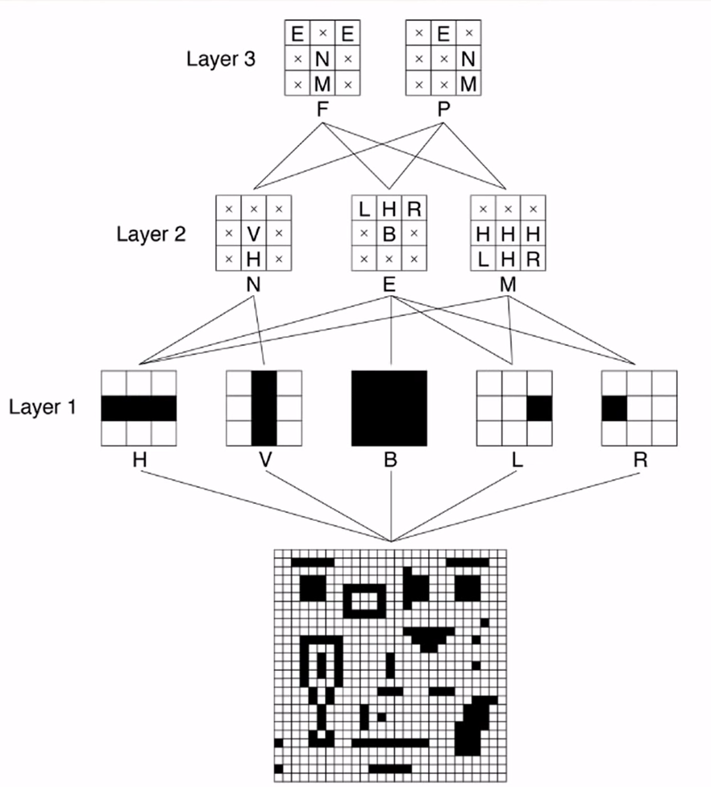
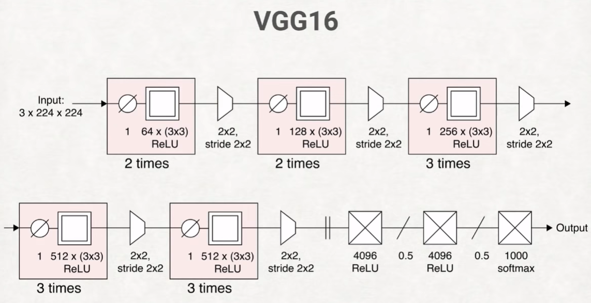

# Deep Learning: A Crash Course

> ACM / SIGGRAPH / Youtube / Deep Learning

https://www.youtube.com/watch?v=r0Ogt-q956I

- 1 epoch：学习一整遍数据
  - Test set只能用一次

- MNIST：手写识别 hello world of ML (70000个手写数字)
  - 首先拆成行, 28*28=784个输入，最终输出10个
- Tensor：多维数组，fully filled
- 网络的图中，箭头是weight。
- ReLU： __/，Sigmoid：S
- softmax：输入一堆结果，输出一堆概率（0~1，和为1）

- Backpropagation：让gradient回传
- learning rate：
  - decay schedules，每个epoch下降一点
  - momentum
- weight叫parameter，learning rate叫hyperparameter
- Dimensionality Reduction
  - PCA，eigenxxx
- 数据量很有限时，验证模型效果用cross-validation
- 如何解决overfitting
  - regularization
    - drop out
- convolution
  - filter超出边界按照0，没啥道理works well
  - 

- Adversaries
- Reinforcement learning
  - Q Learning (Q for Quality)
- Loops
  - Recurrent Neural Network
- GAN
  - Generative Adversarial Network
- 风格画：从noise开始，同时减小filter的输出到风格以及原画的loss

- 推荐在线资源：github.com/blueberrymusic