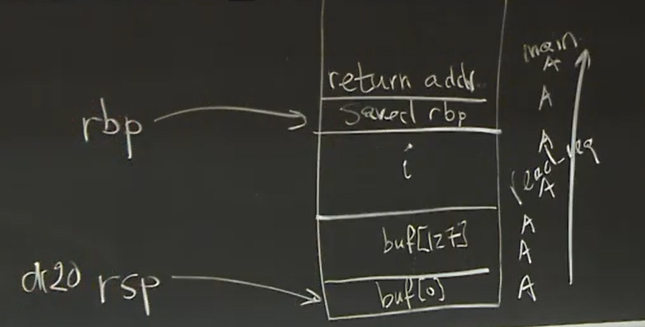

# MIT 6.858: Computer Systems Security

> MIT / 公开课 / computer systems security

课程地址 https://css.csail.mit.edu/6.858/2020/

youtube地址 https://www.youtube.com/watch?v=x6QsaB2aSmU&list=PLA6Ht2dJt3SKN3z4S6nOvuJtesDXbly7S

## Lecture 1: Intro

- Security = goal (despite adversary)
  - Goal: only Alice read F
  - policy: permissions, password, 2FA
  - threat model: guess pw, no steal...
  - mechanism: OS, crypto, devices
- Iterate
  - Past attack
    - post-mortems
  - evolve policy
- Not perfect
  - Cost of attacks
  - Big payoff
  - Recover
- 学校例子
  - 一个读写全部文件的director
  - 若干老师（老师可以：添加某个用户为学生，修改学生的密码）
  - 如果老师添加director为学生orz
- Account recovery
  - 如果recovery的问题还没问题强 orz
- Insecure defaults
  - known def. passwords
  - public def. permissions
  - Negative goal
- Threat model problem
  - secret design/impl
  - security-minded users
  - assuming specific attack vectors
- certificate authorities
- Software dev
  - source repo
  - source dev tools
  - software updates
- bugs
  - ~1 bug / 1000 loc
  - bugs even in non-critical sw
  - bugs in how you policy is implemented
- random for crypto
  - PRNG 伪随机数生成器
- buffer overflow
  - 

## Lecture 2: Security Architecture

- Security Architecture
  - defend classes of attacks
  - unknown attack
  - contain damage
- Google
  - End-user data
  - availability
  - Accountability
- Threats
  - bugs / pw theft / insiders / hardware / network / break in
- Isolation (super important)
  - VMs (KVM in linux)
  - physics (sep. servers.)
  - DCs
  - Languages (语言限制，比如javascript, java)
- Sharing: reference model
  - Policy-Guard on resource
  - Guard write audit log
  - principal (who send request)
    - enduser
    - employee
    - service
    - machine
  - resource
    - userdata
    - bandwidth
    - CPU time
  - Guard
    - Authentication
      - password
      - 2FA (2 factor authentication), such as SMS
      - IP
      - Key (public-key)
    - Authorize
    - Audit 
  - DIrectory
    - principle.name / cred.info
  - Authorization
    - Perm = Policy(principle, res)
    - ACL  --Access control list (a resource, all user's permission)
    - capability --(a user, all permitted resources)
    - ticket
  - Granularity
    - DC? trusted inside, firewall, IDS
    - Service? principal: least priviledge
    - User?
    - Performance...
  - Hardware
    - security chip: monitor BIOS and OS kernel
- Availability: DoS attack
  - DoS mitigation
    - lot of resources
    - Authenticated ASAP --decide by principle
    - Minimize before auth

## Lecture 3 User authentication

