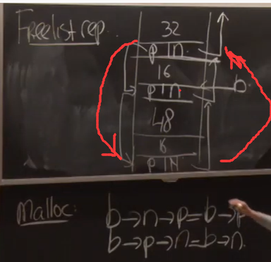

# MIT 6.858: Computer Systems Security

> MIT / 公开课 / computer systems security

课程地址 https://css.csail.mit.edu/6.858/2020/

youtube地址 https://www.youtube.com/watch?v=x6QsaB2aSmU&list=PLA6Ht2dJt3SKN3z4S6nOvuJtesDXbly7S

## Lecture 1: Intro

- Security = goal (despite adversary)
  - Goal: only Alice read F
  - policy: permissions, password, 2FA
  - threat model: guess pw, no steal...
  - mechanism: OS, crypto, devices
- Iterate
  - Past attack
    - post-mortems
  - evolve policy
- Not perfect
  - Cost of attacks
  - Big payoff
  - Recover
- 学校例子
  - 一个读写全部文件的director
  - 若干老师（老师可以：添加某个用户为学生，修改学生的密码）
  - 如果老师添加director为学生orz
- Account recovery
  - 如果recovery的问题还没问题强 orz
- Insecure defaults
  - known def. passwords
  - public def. permissions
  - Negative goal
- Threat model problem
  - secret design/impl
  - security-minded users
  - assuming specific attack vectors
- certificate authorities
- Software dev
  - source repo
  - source dev tools
  - software updates
- bugs
  - ~1 bug / 1000 loc
  - bugs even in non-critical sw
  - bugs in how you policy is implemented
- random for crypto
  - PRNG 伪随机数生成器
- buffer overflow
  - 

## Lecture 2: Security Architecture

- Security Architecture
  - defend classes of attacks
  - unknown attack
  - contain damage
- Google
  - End-user data
  - availability
  - Accountability
- Threats
  - bugs / pw theft / insiders / hardware / network / break in
- Isolation (super important)
  - VMs (KVM in linux)
  - physics (sep. servers.)
  - DCs
  - Languages (语言限制，比如javascript, java)
- Sharing: reference model
  - Policy-Guard on resource
  - Guard write audit log
  - principal (who send request)
    - enduser
    - employee
    - service
    - machine
  - resource
    - userdata
    - bandwidth
    - CPU time
  - Guard
    - Authentication
      - password
      - 2FA (2 factor authentication), such as SMS
      - IP
      - Key (public-key)
    - Authorize
    - Audit 
  - DIrectory
    - principle.name / cred.info
  - Authorization
    - Perm = Policy(principle, res)
    - ACL  --Access control list (a resource, all user's permission)
    - capability --(a user, all permitted resources)
    - ticket
  - Granularity
    - DC? trusted inside, firewall, IDS
    - Service? principal: least priviledge
    - User?
    - Performance...
  - Hardware
    - security chip: monitor BIOS and OS kernel
- Availability: DoS attack
  - DoS mitigation
    - lot of resources
    - Authenticated ASAP --decide by principle
    - Minimize before auth

## Lecture 3 User authentication

- overall
  - underpinning of security policies
  - interesting technical issues
  - security vs. convenience
- user authentiation
  - registration
  - authentication check
  - recovery
- Challenge
  - intermediate principals
    - laptop, phone, load balance
  - user identity
    - registration has often weak identity.
- password
  - good: user friendly / bad: valuable
  - human factor: easy to remember / cross site
  - defense: 
    - rely on pw as little as possible
    - use once per session
    - use password manager
    - rate limit use
    - augment pw with second factor
  - 保存密码：不存明文，用cryptographic hash, 比如存储SHA256(pw)
    - rainbow attack
    - 所以要存储salted password
    - 存储userid, salt, H(pw||salt)
    - expensive hash function
      - google's bcrypt
- 2FA (2 factor authentication)
  - defends against: weak pw
  - phishing attacks (more challenging for attackers)
  - approaches:
    - code SMS
    - Time based on time pw (duo)
      - H(secret||time) secret保存在手机里
      - server might be compromized, 所有duo的secret都不能用了
    - U2F (public key crypto)
      - 2 keys: private, public
      - 步骤
        - server send challenge message m
        - client/device: sign(privkey, m) -> S
        - server: verify(kpub, m, s) -> OK?
      - MITM: men-in-the-middle-attack
        - client对c+origin一起签名。origin是https网站的origin。如果CA或者browser也被Compromized呢？
        - client对c+origin+TLS channel ID 一起签名。这样中间人和服务器之间的TLS  channel ID和中间人与用户之间不同，就被发现。

## Lecture 4: Buffer overflows

- overview

  - real attack, devastating
  - evolution of defense / attacks
  - raises bar worthwhile

- situation

  - buggy C code

- buffer overflow (stack) attack (classic)

  - 通过buffer覆盖return address到buffer内的code。
  - DEFENSE: non-executable
    - return-to-libc attack
      - RA->libc，argument是数据
  - DEFENSE: stack canary (栈上随机数)
    - 在返回之前检查canary和之前是否一样
    - 如果canary下面有函数指针（将要被调用），也可以利用
  - DEFENSE: address space randomization ASLR
    - return to libc 变得很难
    - 但是可能address leaks

- heap overflows

  - ```c
    foo() {
      char *p = malloc(16)
      gets(p);
    }
    ```

  - freelist 每一块有prev next指针

  - buffer overflow是在overflow prev和next指针

    

  - 可以让b->n->p=b->p，b->p->n=b->n

  - b的p和n可以被覆盖，若b->p是x，b->n是y，x和y用攻击者控制，*y=x，即可以写一个任意的位置。

  - DEFENSE: retrofit bound check

    - check all derefences
    - approaches:
      - fat pointers (memory overhead, compatibility)
      - reference obj
      - baggy bound ideas
        - https://www.usenix.org/legacy/event/sec09/tech/full_papers/sec09_memory.pdf
        - each entry covers 16 bytes
        - each entry just hold size
        - Allocate only 2^n
        - Allocate only on 2^n address

## Lecture 5: Privilege seperation

design systems to have security in the presence of bugs

Plan A: avoid bugs (great idea)

Bugs in web services

- buffer overruns
- bugs in SQL escaping
- forgetting access checks
- handling ".." incorrectly

Plan B: tolerate bugs

