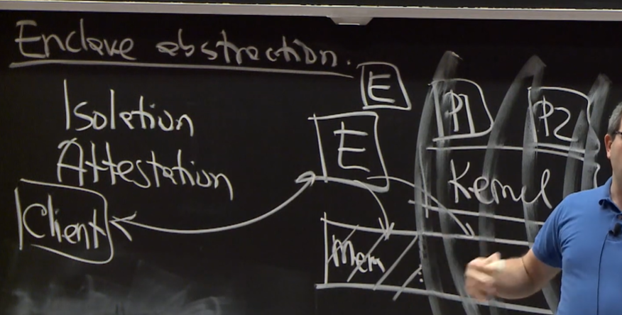
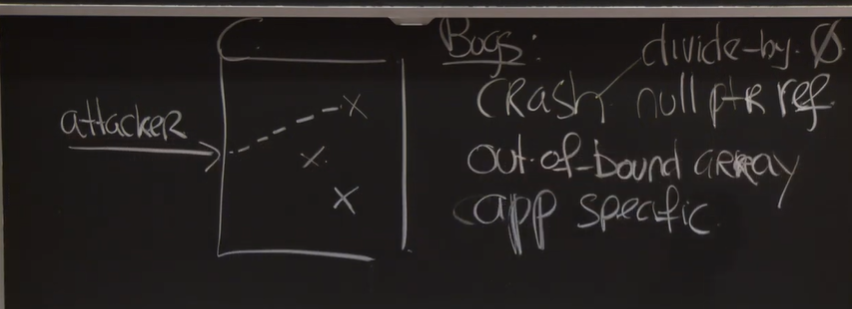

# MIT 6.858: Computer Systems Security

> MIT / 公开课 / computer systems security

课程地址 https://css.csail.mit.edu/6.858/2020/

youtube地址 https://www.youtube.com/watch?v=x6QsaB2aSmU&list=PLA6Ht2dJt3SKN3z4S6nOvuJtesDXbly7S

## Lecture 1: Intro

- Security = goal (despite adversary)
  - Goal: only Alice read F
  - policy: permissions, password, 2FA
  - threat model: guess pw, no steal...
  - mechanism: OS, crypto, devices
- Iterate
  - Past attack
    - post-mortems
  - evolve policy
- Not perfect
  - Cost of attacks
  - Big payoff
  - Recover
- 学校例子
  - 一个读写全部文件的director
  - 若干老师（老师可以：添加某个用户为学生，修改学生的密码）
  - 如果老师添加director为学生orz
- Account recovery
  - 如果recovery的问题还没问题强 orz
- Insecure defaults
  - known def. passwords
  - public def. permissions
  - Negative goal
- Threat model problem
  - secret design/impl
  - security-minded users
  - assuming specific attack vectors
- certificate authorities
- Software dev
  - source repo
  - source dev tools
  - software updates
- bugs
  - ~1 bug / 1000 loc
  - bugs even in non-critical sw
  - bugs in how you policy is implemented
- random for crypto
  - PRNG 伪随机数生成器
- buffer overflow
  - 

## Lecture 2: Security Architecture

- Security Architecture
  - defend classes of attacks
  - unknown attack
  - contain damage
- Google
  - End-user data
  - availability
  - Accountability
- Threats
  - bugs / pw theft / insiders / hardware / network / break in
- Isolation (super important)
  - VMs (KVM in linux)
  - physics (sep. servers.)
  - DCs
  - Languages (语言限制，比如javascript, java)
- Sharing: reference model
  - Policy-Guard on resource
  - Guard write audit log
  - principal (who send request)
    - enduser
    - employee
    - service
    - machine
  - resource
    - userdata
    - bandwidth
    - CPU time
  - Guard
    - Authentication
      - password
      - 2FA (2 factor authentication), such as SMS
      - IP
      - Key (public-key)
    - Authorize
    - Audit 
  - DIrectory
    - principle.name / cred.info
  - Authorization
    - Perm = Policy(principle, res)
    - ACL  --Access control list (a resource, all user's permission)
    - capability --(a user, all permitted resources)
    - ticket
  - Granularity
    - DC? trusted inside, firewall, IDS
    - Service? principal: least priviledge
    - User?
    - Performance...
  - Hardware
    - security chip: monitor BIOS and OS kernel
- Availability: DoS attack
  - DoS mitigation
    - lot of resources
    - Authenticated ASAP --decide by principle
    - Minimize before auth

## Lecture 3 User authentication

- overall
  - underpinning of security policies
  - interesting technical issues
  - security vs. convenience
- user authentiation
  - registration
  - authentication check
  - recovery
- Challenge
  - intermediate principals
    - laptop, phone, load balance
  - user identity
    - registration has often weak identity.
- password
  - good: user friendly / bad: valuable
  - human factor: easy to remember / cross site
  - defense: 
    - rely on pw as little as possible
    - use once per session
    - use password manager
    - rate limit use
    - augment pw with second factor
  - 保存密码：不存明文，用cryptographic hash, 比如存储SHA256(pw)
    - rainbow attack
    - 所以要存储salted password
    - 存储userid, salt, H(pw||salt)
    - expensive hash function
      - google's bcrypt
- 2FA (2 factor authentication)
  - defends against: weak pw
  - phishing attacks (more challenging for attackers)
  - approaches:
    - code SMS
    - Time based on time pw (duo)
      - H(secret||time) secret保存在手机里
      - server might be compromized, 所有duo的secret都不能用了
    - U2F (public key crypto)
      - 2 keys: private, public
      - 步骤
        - server send challenge message m
        - client/device: sign(privkey, m) -> S
        - server: verify(kpub, m, s) -> OK?
      - MITM: men-in-the-middle-attack
        - client对c+origin一起签名。origin是https网站的origin。如果CA或者browser也被Compromized呢？
        - client对c+origin+TLS channel ID 一起签名。这样中间人和服务器之间的TLS  channel ID和中间人与用户之间不同，就被发现。

## Lecture 4: Buffer overflows

- overview

  - real attack, devastating
  - evolution of defense / attacks
  - raises bar worthwhile

- situation

  - buggy C code

- buffer overflow (stack) attack (classic)

  - 通过buffer覆盖return address到buffer内的code。
  - DEFENSE: non-executable
    - return-to-libc attack
      - RA->libc，argument是数据
  - DEFENSE: stack canary (栈上随机数)
    - 在返回之前检查canary和之前是否一样
    - 如果canary下面有函数指针（将要被调用），也可以利用
  - DEFENSE: address space randomization ASLR
    - return to libc 变得很难
    - 但是可能address leaks

- heap overflows

  - ```c
    foo() {
      char *p = malloc(16)
      gets(p);
    }
    ```

  - freelist 每一块有prev next指针

  - buffer overflow是在overflow prev和next指针

    - 

  - 可以让b->n->p=b->p，b->p->n=b->n

  - b的p和n可以被覆盖，若b->p是x，b->n是y，x和y用攻击者控制，*y=x，即可以写一个任意的位置。

  - DEFENSE: retrofit bound check

    - check all derefences
    - approaches:
      - fat pointers (memory overhead, compatibility)
      - reference obj
      - baggy bound ideas
        - https://www.usenix.org/legacy/event/sec09/tech/full_papers/sec09_memory.pdf
        - each entry covers 16 bytes
        - each entry just hold size
        - Allocate only 2^n
        - Allocate only on 2^n address

## Lecture 5: Privilege seperation

design systems to have security in the presence of bugs

Plan A: avoid bugs (great idea)

Bugs in web services

- buffer overruns
- bugs in SQL escaping
- forgetting access checks
- handling ".." incorrectly

Plan B: tolerate bugs

- provilege seperation

  - benefits:
    - limits the damage of an attack (least privilege)
    - limits access to buggy code (reduces attack surface)
  - challenges:
    - what is the seperation plan?
    - how to isolate?
    - how to share?
    - maintain performance?

- seperation plan, a real example

  - divide website into services

  - services (assumptions: face end users, buggy):

    - login, matching, msg, photos, profile editor
    - services get tokens from okld, token is used to issue RPC

  - have a dbproxy, talk to db (assumptions: written by experienced programmers)

    - avoid SQL things in services, dbproxy accept RPC calls.
    - construct SQL queries, 
    - access control

  - OKD: handle all http requests

  - OKLD: listen on 80

  - Logger: servies can write, OKLD can write, etc.

  - | service   | harm             | surface                   |
    | --------- | ---------------- | ------------------------- |
    | OKld      | big              | narrow                    |
    | OKD       | http traffic     | first line of HTTP        |
    | OKlogd    | trash the log    | logging RPC               |
    | service i | data used by svc | partial data, limited RPC |

  - Discussion

    - Separation by service
    - where should attacker focus
      - service, OS

- Isolation mechanisms

  - physical machines
  - virtual machines
  - processes
    - creates new process, allocate UID (not correspond to UNIX users), setuid, chroot(dir)
  - containers
    - own file system
    - own ip address
    - like virtual machine, but using UNIX process mechanism

## Recitation 1: Linux Containers

- Privilege Seperation

  - Least Privilege (LP)
  - Seperation of duties (SoD)

- Implementation: Technical Controls

  - DAC: *nix permissions and facl
  - LP: seccomp, capabilities
  - isolation: hwvirt, chroot, namespaces, lxc

- container: one hardware, one kernel, multiple userland; virtual machine: one hardware, multiple kernels/OSs.

  - running container is a set of processes.
  - namespaces;
  - Cgroups: Isolate processes; limit resource usage.
  - capabilities
  - seccomp-ppf

- Linux namespaces

  - logically isolate kernel elements
  - namespaces:
    - PID
    - UTS {hostname, domainname}
    - Network
    - Cgroup
    - IPC (ipc call)
    - User
    - Mount
  - clone call
    - child_pid = int clone(..., CLONE_NEWUTS, .....)
    - set_ns(2)
    - unshare(2)
    - ...

- cgroups

  - limit hardware resources

- Capabilities 

  - enforce namespaces and reduce undesired privileges
  - getcap, setcap

- Secure Computing (seccomp-bpf)

  - filter kernel syscalls

- LXC, docker .... many container techniques.

- lxc:

  - man lxc.container.conf

  - communication between containers or host:

    - network bridge

    - kernel have a feature: net builder

      - iptables: 

      - | tables                                             | chains                                                       | targets                      |
        | -------------------------------------------------- | ------------------------------------------------------------ | ---------------------------- |
        | raw<br />security<br />filter<br />mangle<br />nat | input<br />output<br />forward<br />prerouting<br />postrouting | accept<br />reject<br />drop |

## Lecture 6: Software Isolation

little/no hw/os support

contain suspect / untrusted code

use sandboxing

- keep bad code inside sandbox

Software Isolation

- Language specific (javascript)

  - javascript interpreter

- Language independent

  - x86 instructions
  - Chrome used to support native client(NaCl), but no longer, bacause WebAssembly is comming.

- NaCl

  - broswer
  
- 
  
- Sandboxing goals
  
    - don't execute disallowed instructions
      - INT instruction
      - RET instruction
      - load DDT etc
    - don't write memory outside of the box (trampoline means蹦床)
  - 
  
- validator
  
    - safe instructions: allow (such as add)
    - sometime safe: instrument
  - unsafe: disallow
  
- challenges
  
    - variable-length instructions (x86 specific)
    - guarding ld/st/jump arguments
    - entering / exiting a module
      - module ask RTS (runtime system) do do things for it
    - runtime system is also sandboxed (outer sandbox, OS provided, backup protection, syscall limited)
  
- Ex Decoding
  
  - x86: instruction boundry matters
  
    - should never jump into middle of instructions
  
  - solution: reliable dissambly
  
    - phase 1: build target table with all address of instructions
  
    - phase 2: look through all jmp
  
      - jmp fixed address solved
  
      - computed jmp ?
  
        - get help from compiler and validator
  
          - ```
            jump %eax 
            ==> 
            AND $0xFFFFFFE0, %eax
            jmp %eax     (address is aligned to multiple of 32)
            ```
      ```
          
      ```
      
    - used in: virtual method calls in C++
      
      - so put targets @32-byte-aligned address
        
          - if instruction cross 32-byte-aligned address, fill with no-op.
    
    - return is turned into jmp.
  
- guarding ld/st/jmp (need to avoid writing / jumping RTS)
  
    - 64bit x86: instruments a bit more
    - 32bit x86: segmentation
      - segement registers %CS %DS %SS
        - directly use hardware to check segment bound.
    - call runtime:  jump to trampoline code (32bit aligned longjump code)
    - what if user write tranpoline code to jump to any place in RTS?
      - code section is readonly
    - RTS return: call tranpoline, using spring board to jump back to module
      - 32-bit+1instr aligned, first instruction is halt 
      - RTS can jump to instruction after halt
    - module can only halt if jump to spring board.
  
- Summary
  
    - software isolation, is possible, NaCl is a clever design.

## Lecture 7: Enclaves

Intel SGX Software Guard Extensions

Isolation, Strong threat model, cutting edge tech

Tradition:

- OS process
  - 

Enclave goal

- compromized OS, cannot provide isolation anymore
  - user / operator
  - physics attacks
  - malware
  - bugs in OS
- keep seccrets(important data), not availability(running)
- Abstraction
  - Isolation
  - attestation (证明，证据)
    - kernel is able to start enclaves
    - what is actually running, is the right enclave running?
    - 

- prior approaches about compromised OS
  - TPM / secure boot: check what kernel boots
  - Seperate CPU
    - Apple, Android phones, 
      - unlocking devices, checking pin, cryptographic keys, etc.
    - cost, not flexible
    - hypervisors / VMs
- Enclaves: SGX, Komodo
  - 
  - SGX的monitor是在CPU里的，无需安装软件
  - Komodo: use ARM Trust Zone, monitor not in CPU, so have bootloader
  - Isolated memory
    - CPU可以控制kernel的访问，但是NIC/GPU等可以DMA
    - 在移动端独立mem是常见的，嵌入式很容易设计各种special硬件，但x86都是标准化的。
    - DMA capable devices如今有iommu可以配置page table
    - SGX的做法是CPU可以加密解密
  - Execution modes
    - 
  - attestation
    - 
  - monitor:
    - pages: 4KB of mem
    - PageDB, page type:
      - Unused 
      - AddressSpace
      - Thread
      - L1 PT
      - L2 PT
      - Data
      - Spare
    - kernel->mon: create enclave
      - initAS(aspg, l1pt)
      - InitL2(sdpg, l2pt, idx)
      - mapSecure(aspg, cdatapg, v, content)
      - InitThread(aspg, threadpg, entry)
      - Finalize()
      - Enter(thread)

## Lecture 8: Mobile device security

generally better than desktop security

Enclave support

- Threat model
  - attacker steals phone + want to read data

  - Assumptions: phone locked, password protected
- Why care?

  - customers who must keep secrets
  - ordinary customers
  - competitive adv.
  - Try to do the right thing
- Potential attacks

  - exhaustive pw search
  - Impersonating fingerprints
  - removing flash chips
  - bugs in kernel, bugs in driver sw.
  - secure boot 
- hardware overview
  - 

- design issures
  - secure boot
  - enclave
  - Data encryption
- Secure boot (order)
  - Boot ROM  <-- apple's public key
  - iboot (check signature  signed by apple's private key)
  - enclave kernel
  - before is enclave -------------------------- below is main
  - UEFI
  - iOS
  - app
- protection against downgrade attack
  - 

- Enclave:
  - manages all keys
  - limit pw guessing
  - sensor-to-enclave communication
    - shared crypto key
  - protecting user key
    - userkey = $E_{uid}(E_{uid}(..password))$
      - many times: takes longer time
- background apps
  - idea: key wrapping
  - take one key, encrypt it with another key
- File encryption
  - one key per Filesystem $K_{fs}$
  - Enclave: $E_{uid}(K_{fs})$
  - file metadata encrypted using $K_{fs}$
  - 不是太懂
  - 4 protection levels
    - complete
    - complete unless open
    - until first auth
    - no protection
- how secure is it? Attack surface
  - Apples private key
  - read UID
  - Bugs in iOS
    - enclave mechanism only protect when phone is locked, not unlocked (user data would be in memory)
  - Bugs in booting

## Lecture 9: Mobile app security

Desktop apps

- files
- users are principals
- apps, run with full user privs
- benefits
  - sharing is easy
  - data vs apps, spilted

Web apps

- isolation for apps
- No file system
- No sharing

Android app

- binary-> run as a process on linux
- store files /data/data/appname
- manifest -> security properties
- whole thing is signed by developer, an apk file.
- sharing in android:
  - messages, called "intent"
  - app send intent to kernel
  - reference monitor (special process), kernel send intent to it, reference monitor send to kernel again, kernel send to target.
  - 
- intent:
  - 组成
    - name of component, e.g. com.google.Dialer / Component  <= app defines
    - action field: e.g. DIAL   <= android pre defines
    - data: e.g. tel 1617...
  - **component is option**! implicit intent, if multiple answer, popup for user to select.
- intent permissions: label: string e.g. DIALPERM
  - 
  - perms comes from in app manifest
    - define new label
    - request privileges: list labels (require user consent)
      - 应用如果从别的app那里获取信息，必须通过intent发送消息。
    - component protection label (那些有label的app可以发消息给该component)
- Types (permission)
  - normal permissions (avoiding annoyances)
  - dangerous -> need prompt
  - signatures permissions  (only app from the same developer to share stuff, a label that help developers split their app)
- signature is important: though first fime install don't know public key from who, update is able to verify
- android's plan: mandatory access control (MAC)
  - even if code is buggy (not in application code)
  - analyze
  - default secure
  - contract to: Discretionary access control (DAC), force policy on code
    - apps can set perms
- android's plan里的特例
  - RPC between services (android)
    - RPC comp, 即使有label，别的app有对应label，RPC comp仍然可以检查caller是谁，选择性拒绝。这是一个特殊情况。
  - broadcast intents
    - broadcast(intent = SMS_RECEIVED, label = RECEIVE_SMS)
    - 只发送给有RECEIVE_SMS label的app
    - RECEIVE_SMS是个dangerous permission

## Lecture 10: Symbolic Execution

Finding bugs

- symbolic execution
  - difficult to find using fuzzing etc.
- Bug ~ exploit
- finding exploit is often hard
  - encourage security folks to find exploits
  - learn from exploits
  - protocol for disclosure (e.g. 2/3 months)
- approaches to finding bugs
  - verification: eliminates classes of bugs
  - testing: 
    - known bugs
  - fuzzers: cook up really unusual input
    - unknown bugs
    - use symbolic execution to improve
- setting
  - 
- goal: find deep bugs
  - ideas: 
    - compute symbolic values
    - create path conditions
    - use solvers to see if a branch is possible (avoid path exploration)
- Exe Overview:
  - compile time step:
    - C to C compiler: instrument it, every branch statement calls to Exe runtime.
  - Runtime: explore path
  - Runtime components
    - 
    - scheduler? 深度优先/宽度优先?  深度优先可能陷入loop

Example:

- 

- variable x, y, pathcondition(pc).

- 


- - 


Real example: berkeley packet filter.

Lab3, symbolic execution用Z3

将数字作为bitarray，数学运算在bitarray上操作，然后换成boolean问题，用SAT solving

- easy: x+7=y
- hard: x*x=900
- tooooo hard: 10=sha256(x)

Arrays

- S[C]  easy (symbolic array, concrete index)
- C[S] hard (symbolic index, concrete array)
- *S  hard (symbolic pointer)

They give up floating point, not associative，不满足结合律

Discussion:

- size of execution tree?
  - really big, but can be done is already impressive
- how long will exe run? depends.
- Find all bugs? 
- how to deal with lib/db/fs?
  - concolic execution (symbolic + concrete)

## Lecture 11: Web Security Model

complexity

- Text, images
- cookies, js
- sensitive apps
- retrofit security

Constraints

- compact
- many browsers
- lots of sharing

Threat model

- attacker: own some domain a.com
- victim: visit a.com
- victim visit important site
- +browser trusted, bugfree
- not network stacks

Same-origin policy

- **https://foo.com:443(implied)**/bar/x.html
- scripts --> have an origin
- resource --> have an origin
- allow script to poke resource if origin is the same

Network

- Identify server? TLS+cert=HTTPS
- identify client? Cookies 

cookies

- | domain  | key   | value |
  | ------- | ----- | ----- |
  | mit.edu | athen | nicko |

- cookie like a session identifier

- cookie security

  - SOP: origin ~ domain (但是也可能domain和origin不一致)
  - send all matching cookies
  - who can set cookie?
  - public suffix (不能设置public suffix的cookie)
    - a.co.uk不能设置.co.uk
  - 


