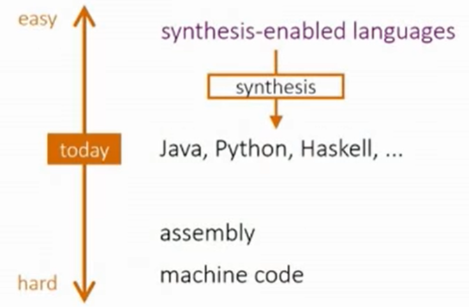

# Microsoft Research Talk: Type Driven Program Synthesis

> Program Synthesis / Microsoft research / youtube

https://www.youtube.com/watch?v=Q-3tcbUyF34&t=3596s

- Why synthesis?
  - 

- 避免搜索过大的空间（分解目标）
  - picking the right specification language
- Synquid (program synthesis with refinement type)
- 