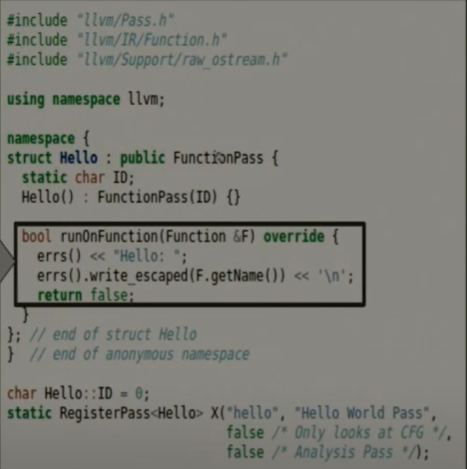
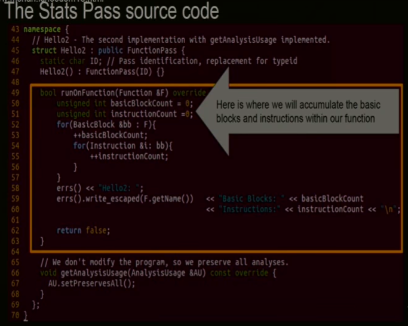
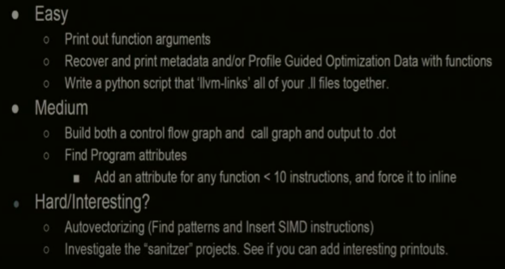
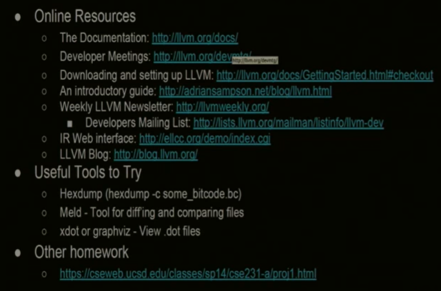

# YouTube: Introduction to LLVM Building simple program analysis tools and instrumentation

> youtube / program analysis / LLVM

- https://www.youtube.com/watch?v=VKIv_Bkp4pk&t=4312s

- an introduction to LLVM
- LLVM的paper
  - LLVM: A compilation Framework for Lifelong Program Analysis & Transformation
- Chris Lattner's big idea
  - source code => frontend -> optimizer -> backend => machine code

LLVM IR

- 非常readable和writable
  - well-defined
- IR是strongly typed
- 无限数量寄存器
- IR使用SSA (single static assignment)

LLVM工具： 

- lli直接执行IR程序(文本文件是 .ll)
- IR有更紧凑的binary form，叫bitcode，（.bc）
- llvm-as将ll变成bc
- llc，将IR编译成assembly (.s)
- opt优化工具
  - opt有passes

LLVM有多种pass

- 根据粒度
  - module pass
  - call graph pass
  - function pass
  - basic block pass
  - immutable pass, region pass....
- analysis pass VS transform pass
  - 前者gathering info
  - 后者有side effect
- 

- 编译得到so文件，使用opt工具运行
  - opt -load so文件位置 -pass名< 输入IR文件.bc
- Anatomy of a Pass

Static Analysis

- 

- 官方文档有WriteALLVMPass

- LLVM实际上提供了一个pass可以输出control flow graphs
  - 输出dot文件
  - `opt -dot-cfg-only IR文件`
  - 用xdot查看dot文件

Dynamic Analysis

- 有一些代码希望被instrument
- 写一个hook或者profiling code
- 为hook创建IR
- InstrumentEnterFunction

llvm-link

- 合并IR代码

- 资源

