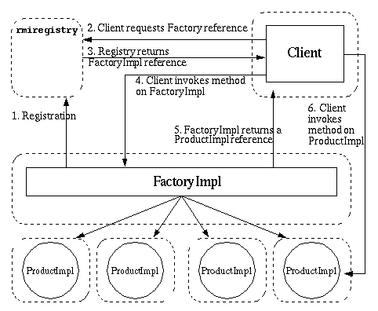

# Java Basics

> learn basics / java / rmi

## Getting Started Using Java RMI

https://docs.oracle.com/javase/8/docs/technotes/guides/rmi/hello/hello-world.html

steps:

- define the remote interface
- implement the server
- implement the client
- compile the source files
- start the Java RMI registry, server, and client

A Java RMI registry is a simplified name service that allows clients to get a reference (a stub) to a remote object. In general, **a registry is used (if at all) only to locate the first remote object a client needs to use**. Then, typically, that first object would in turn provide application-specific support for finding other objects. For example, the reference can be obtained as a parameter to, or a return value from, another remote method call. For a discussion on how this works, please take a look at [*Applying the Factory Pattern to Java RMI*](https://docs.oracle.com/javase/8/docs/technotes/guides/rmi/Factory.html).

## Applying the Factory Pattern to Java RMI

https://docs.oracle.com/javase/8/docs/technotes/guides/rmi/Factory.html



## Tuple的一个实现

```java
package mazegame;

public class Tuple<T1, T2> {
    public final T1 first;
    public final T2 second;
    public Tuple(T1 first, T2 second) {
        this.first = first;
        this.second = second;
    }

    @Override
    public String toString() {
        return "(" + this.first.toString() + ", " + this.second.toString() + ")";
    }

    @Override
    public boolean equals(Object other) {
        if (other instanceof Tuple<?,?>) {
            try {
                @SuppressWarnings("unchecked")
                Tuple<T1,T2> tpOther = (Tuple<T1,T2>)other;
                return this.first.equals(tpOther.first) && this.second.equals(tpOther.second);
            } catch (ClassCastException e) {
                return false;
            }
        }
        return false;
    }
}
```

