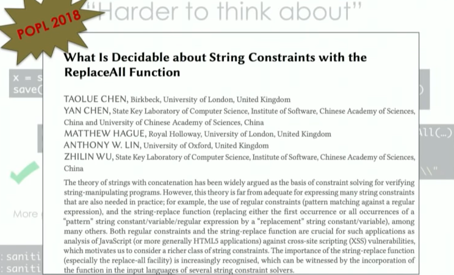

# Resources: Program Synthesis

> Program synthesis / resources

- Deep Learning for Program Synthesis
  - https://sunblaze-ucb.github.io/program-synthesis/index.html

## Read/watched stuff

Exact and Approximate Methods for Proving Unrealizability of Syntax Guided Synthesis

https://www.youtube.com/watch?v=B6CNZTHSuno

https://www.youtube.com/watch?v=_jsLZw1rkHM

SYNT2020 uchicago 网站

http://pl.cs.uchicago.edu/synt2020/program.html

SYNT 2020: Program Synthesis for Usable Programming Tools

https://www.youtube.com/watch?v=vk0v0-sgVl4&list=PLMPy362FkW9op455V_mIBVZk7JV8trWG1

SYNT 2020: Gradient Descent over Metagrammars for Syntax-Guided Synthesis

https://www.youtube.com/watch?v=HUPijcxpiEI&list=PLMPy362FkW9op455V_mIBVZk7JV8trWG1&index=2

SYNT 2020: Neuro-Symbolic Program Synthesis from Natural Language and Demonstrations

https://www.youtube.com/watch?v=R0aURMOmY3g&list=PLMPy362FkW9op455V_mIBVZk7JV8trWG1&index=8

SYNT 2020: Synthesis in Uclid5

https://www.youtube.com/watch?v=UK2Z8xnq8r8&list=PLMPy362FkW9op455V_mIBVZk7JV8trWG1&index=3

a good talk by James Koppel http://www.jameskoppel.com/ 

he's in group http://groups.csail.mit.edu/cap/

**You are a Program Synthesizer" by James Koppel,** 

https://www.youtube.com/watch?v=ldkF-4WNZqA&t=1347s

