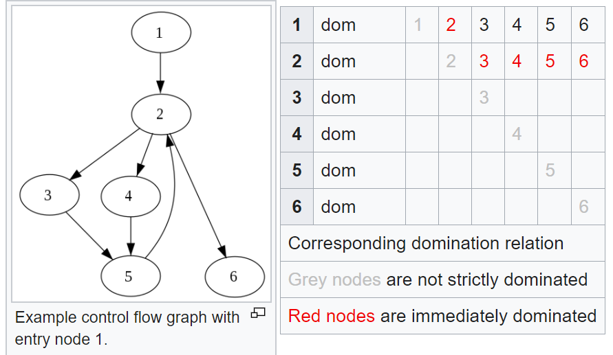
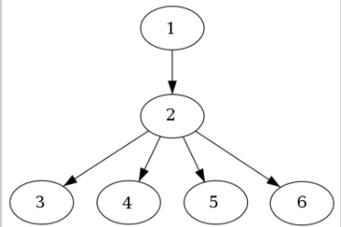
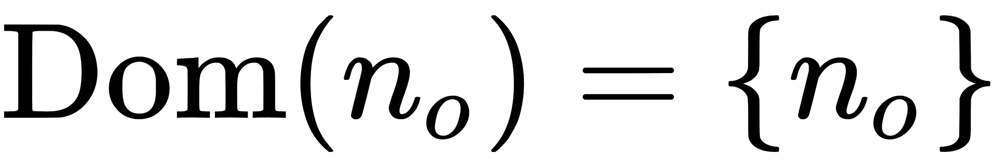
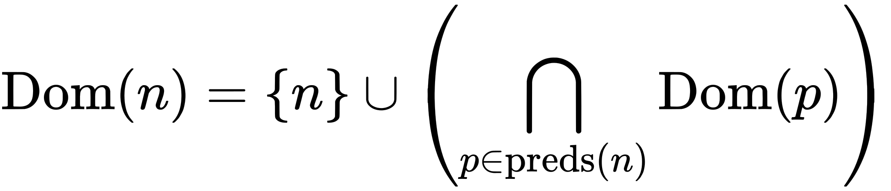

# PL杂烩

> Programming Languages / PL / 文章 / 视频

## Why Study Programming Languages?

CMU 15-312 Foundations of Programming Languages

- https://www.cs.cmu.edu/~rwh/courses/ppl/phil.html

## Turing Machine and Turing Complete

Turing Machine https://www.youtube.com/watch?v=dNRDvLACg5Q

Turing Complete https://www.youtube.com/watch?v=RPQD7-AOjMI

Chomsky hierarchy https://www.youtube.com/watch?v=224plb3bCog

## Dominator (Graph Theory)

https://en.wikipedia.org/wiki/Dominator_(graph_theory)

**Algorithm:**

The dominators of a node n are given by the maximal solution to the following data-flow equations:

