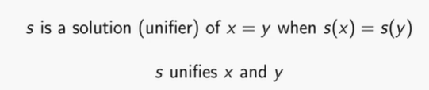
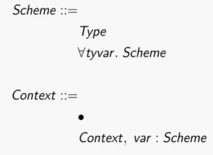

# Youtube: Type Inference & Unification

> PL / type inference / youtube 

https://www.youtube.com/watch?v=45rZ1dYkgbY


- T-LAM
  

Type Inference

what is the type of `λb.if b then false else true`


solve to 

```
constraints:
bool = bool
?0 = bool

type is:
?0 -> bool
```


Unification,

find substitution s:



most general (solution/unifier):


idempotence:

- s ⚪ s = s

- the combination of substitution s is still s.

! most general unifier 将是 idempotence 的

unify

- unify: Set Equation -> Substitution

- unify({}) = id
- 

Polymorphism




