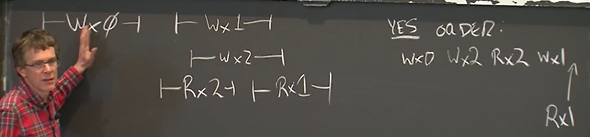
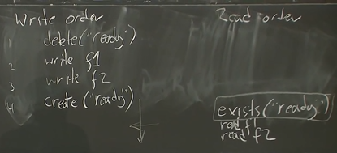
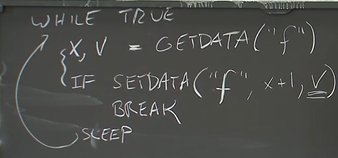
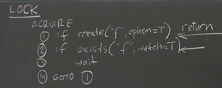
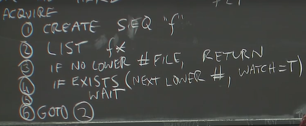

# Zookeeper

> distributed systems / zookeeper

## 6.824 Lecture 8

Linearizability

- a history is linearizable if: 存在total order of operations, matches real time, reads see preceding write in the order.
- 

Zookeeper

- Why?
  - API: general purpose coordination service
  - N times servers ==?==> N times performance
- write to leader, read to replicas
  - 从replica读取的问题：
    - 可能不是majority中的server
    - 可能还没收到leader的commit信息
  - zookeeper不保证总是读fresh data，
    - 保证Linearizable writes (across all clients)
    - FIFO client order (即使client switch to另一个replica)
      - writes —— client-specified order
      - reads —— only forward log order (message with ZX ID, replica might wait until log up to that id)
  - how to guarantee a read after write?
    - 
    - 有watch API (需要进一步了解)
- motivation:
  - test-and-set
  - configuration information
  - leader election
- Z nodes (like file and directories)
  - regular (permanent)
  - ephemeral (will be deleted if no heart beat)
  - sequential
- API
  - CREATE(PATH, DATA, FLAGS)
    - exclusive
  - DELETE(PATH, V)
  - EXISTS(PATH, WATCH)   (watch notice will be guaranteed before see related writes)
  - GETDATA(P, WATCH)
  - SETDATA(P, DATA, V)
- Atomic inc (mini-transaction)? (suffer herd effect)
  - 
- Non-Scalable Lock (suffer herd effect)
  - 
- Scalable Lock (not suffer from herd effect)
  - create SEQ "f" should be ephemeral 
  - 
  - 本身并不保证原子性，如果之前的人failed了，留下了garbage