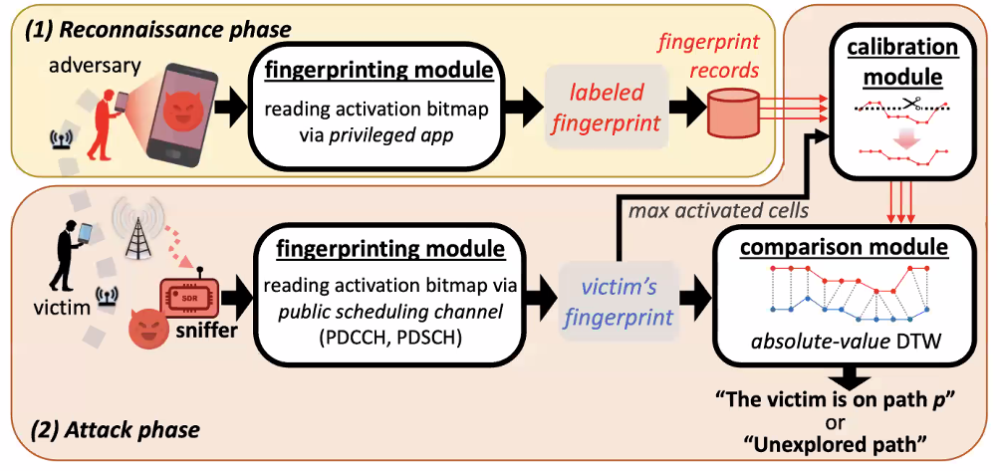

# SoC Security Students Group

> security / group / talks

- Cellular communication till early LTE
  - Increasing data consumption, speed
- Current cellular communication LTE-A
  - Carrier aggregation: 1 primary cell + 2 secondary cell (3CA)
  - primary cell always connected,
  - secondary cell on demand.
- 5G 最高可能32CA, extreme densities of small cells
- Three procedures for CA
  - 1) Configuration
  - 2) Activation
  - 3) Transmission

这篇文章的目标：说明那个bitmask并不benign，也应该被加密。

side channel => path fingerprint

- System and threat model
  - Aim: identify paths taken by the victim among all his possible walking paths

- SLIC Attack
  - 

point: sniffer能听到Primary CA，可以根据进一步确定更精确的位置。

Countermeasures?

- Long term solution: encrypting secondary-cell activation bitmap
  - require significant changes in the protocol stack
  - changes to key generation / management schemes
- short term solutions:
  - adding noise to the side channel
    - noisy but still available
  - changing device identifiers frequently

Two lessons learned:

- side channel exists in 5G makes exploit possible.
- Non-trivial demonstration of attacks is not yet fully deployed by 5G

if secondary cells are uniformly deployment?

## Privacy Risks of Embedding Models?

Word Embeddings:

- Discrete tokens to continuous space
- Distance measures similarity

Sentence Embeddings

How to use Embeddings Models?

- benefits: pre-trained sentence embeddings，更少数据就能训练

Attack: (embedding inversion)

- reconstruct private data

- infer sentence attributes (race, gender, etc)

