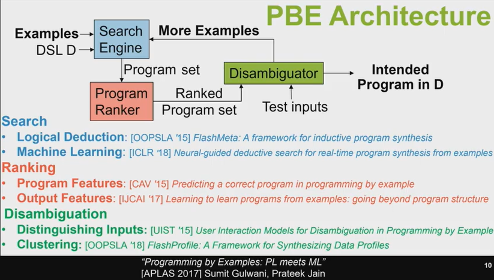
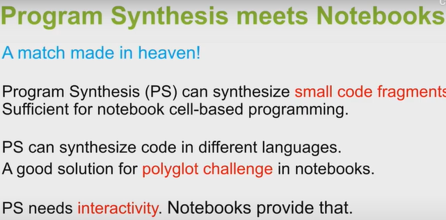

# Heapcon 2019: Automated  Program Generation from Input-Output Examples (PROSE, Microsoft)

> Microsoft Research / PROSE / Program Synthesis

Programming by Examples: PL meets ML (APLAS 2017)

- BPE Arhitecture

- Mode-less Synthesis
  - Applications:
    - document editing
    - robotic process automation
    - code refactoring
  - key idea: identify related examples within noisy action traces
  - Non-intrusively watch, learn, and make suggestions.
  - Facilitates usability and avoids discoverability issues.
- predictive synthesis
  - Applications:
    - Tabular data extraction
    - Join
    - Sort
    - Split
  - key idea: structure inference over inputs
  - Predictive Synthesis : PBE :: Unsupervised : Supervised ML
  - Synthesis of intended programs from just the input

- Synthesis of Readable Code
  - Synthesis in target language of choice
    - python R Scala PySpark
  - Challenges: Quantify readability, Quantitative PBE
  - Key Idea: Observationally-equivalent (but non-semantic preserving) transformation of an intended program
  - advantages: 
    - Transparency
    - integration with existing workflows in IDEs, Notebooks
    - Education

- Program Synthesis is key to next-generational programming
  - multi-modal programming with Examples and NL
- Next-generational AI techniques under the hood.
  - logical reasoning + Machine Learning
  - Microsoft PROSE SDK: https://microsoft.github.io/prose

