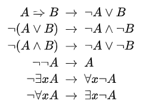

# Mathematical Logic 有关概念

> PL / Logic / 数理逻辑 / 概念

- Negation normal form (https://en.wikipedia.org/wiki/Negation_normal_form)
  - In [mathematical logic](https://en.wikipedia.org/wiki/Mathematical_logic), a formula is in **negation normal form** if the [negation](https://en.wikipedia.org/wiki/Negation) operator ($\lnot$, not) is only applied to variables and the only other allowed [Boolean operators](https://en.wikipedia.org/wiki/Boolean_algebra) are [conjunction](https://en.wikipedia.org/wiki/Logical_conjunction) ($\land$, and) and [disjunction](https://en.wikipedia.org/wiki/Logical_disjunction) ($\lor$, or).
  
  - 非操作符只在变量上
  
  - NNF不是canonical form：比如$a \land (b \lor \lnot c)$和$(a \land b) \lor (a\land \lnot c)$等价
  
  - 在很多model logics里，formula都可以化为这一形式，using [De Morgan's laws](https://en.wikipedia.org/wiki/De_Morgan's_laws)   
  

