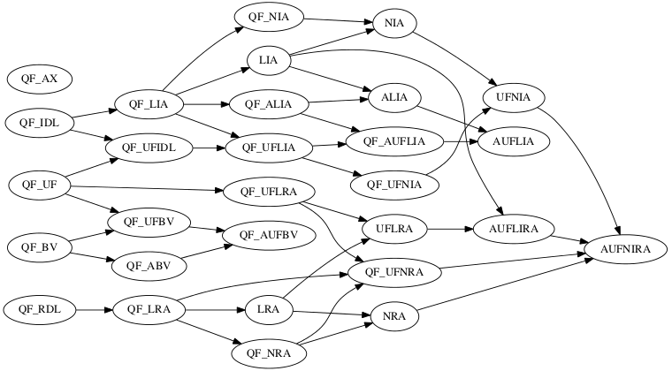

# SMT / SAT 相关资源

> SAT / SMT / 资源 / PL

SMT-LIB

- http://smtlib.cs.uiowa.edu/index.shtml
- common input and output languages for [SMT solvers](http://en.wikipedia.org/wiki/Satisfiability_Modulo_Theories#SMT_solvers).
- Related SMT Solvers: http://smtlib.cs.uiowa.edu/solvers.shtml

CVC4 https://cvc4.github.io/

- CVC4 is the fourth in the Cooperating Validity Checker family of tools.

- CVC4 works with a version of first-order logic with polymorphic types and has a wide variety of features including:
  - several built-in base theories: rational and integer linear arithmetic, arrays, tuples, records, inductive data types, bit-vectors, strings, finite sets and relations, separation logic, floating point arithmetic, and equality over uninterpreted function symbols
  - support for quantifiers
  - an interactive text-based interface
  - a rich C++ API for embedding in other systems
  - model generation abilities

Z3 https://github.com/Z3Prover/z3

Logics Category http://smtlib.cs.uiowa.edu/logics.shtml

- The logics have been named using letter groups that evoke the theories used by the logics and some major restriction in their language, with the following conventions:
  - **QF** for the restriction to quantifier free formulas
  - **A** or **AX** for the theory [ArraysEx](http://smtlib.cs.uiowa.edu/theories-ArraysEx.shtml)
  - **BV** for the theory [FixedSizeBitVectors](http://smtlib.cs.uiowa.edu/theories-FixedSizeBitVectors.shtml)
  - **FP** (forthcoming) for the theory [FloatingPoint](http://smtlib.cs.uiowa.edu/theories-FloatingPoint.shtml)
  - **IA** for the theory [Ints](http://smtlib.cs.uiowa.edu/theories-Ints.shtml) (Integer Arithmetic)
  - **RA** for the theory [Reals](http://smtlib.cs.uiowa.edu/theories-Reals.shtml) (Real Arithmetic)
  - **IRA** for the theory [Reals_Ints](http://smtlib.cs.uiowa.edu/theories-Reals_Ints.shtml) (mixed Integer Real Arithmetic)
  - **IDL** for Integer Difference Logic
  - **RDL** for Rational Difference Logic
  - **L** before **IA**, **RA**, or **IRA** for the linear fragment of those arithmetics
  - **N** before **IA**, **RA**, or **IRA** for the non-linear fragment of those arithmetics
  - **UF** for the extension allowing free sort and function symbols

Theories http://smtlib.cs.uiowa.edu/theories.shtml

- SMT-LIB logics refer to one or more theories below

- [Unicode character strings and regular expressions](http://smtlib.cs.uiowa.edu/theories-UnicodeStrings.shtml)

- [Ints](http://smtlib.cs.uiowa.edu/theories-Ints.shtml)