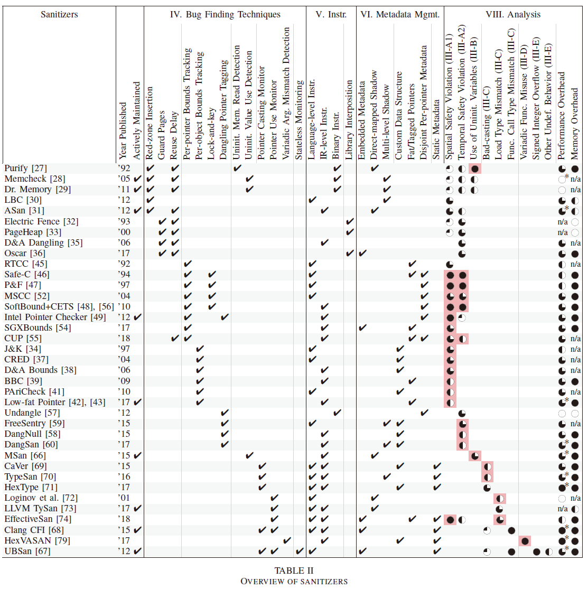

# 【论文阅读】S&P 2019 SoK: Sanitizing for Security

> S&P / 2019 / Security / Sanitizer

- Low-level vulnerabilities
  - Memory Safety Violations
    - Spatial Safety Violations
    - Temporal Safety Violations
  - Use of Uninitialized Variables
  - Pointer Type Errors
    - The C++ **reinterpret_cast** type conversion operator is similarly not subject to any restrictions. The **static_cast** and **dynamic_cast** operators do have restrictions. **static_cast** forbids pointer to integer casts, and casting between pointers to objects that are unrelated by inheritance. However, it does allow casting of a pointer from a base class to a derived class (also called **downcasting**), as well as all casts from and to the void\* type. **Bad-casting (often referred to as type confusion)** happens when a downcast pointer has neither the run-time type of its referent, nor one of the referent’s ancestor types.
    - To **downcast safely**, programmers must use the **dynamic_cast** operator, which performs run-time type checks and returns a null pointer if the check fails. Using **dynamic_cast** is entirely optional, however, and introduces additional run-time overhead.
    - Type errors can also occur when casting between function pointer types. Again, C++’s **reinterpret_cast** and C impose no restrictions on casts between incompatible function pointer types.
  - Variadic Function Misuse
    - C/C++ support **variadic functions**, which accept a variable number of variadic function arguments in addition to a fixed number of regular function arguments.
  - Other Vulnerabilities
    - signed integer overflow, etc
    - dereferencing a pointer lets the compiler safely assume that the pointer is non-null
- Bug Finding Techniques
  - Memory Safety Violations
    - Location-based Access Checkers
    - Identity-based access checkers
    - Spatial Memory Safety Violations
      - Red-zone insertion
      - Light-weight Bounds Checking (LBC)
        - Light-weight Bounds Checking (LBC) similarly inserts red
          zones, but adds a fast path to the location-based access checks to reduce the overhead of the metadata lookups
      - Guard Pages
      - Per-pointer Bounds Tracking
      - Per-object Bounds Tracking
    - Temporal Memory Safety Violations
      - Reuse Delay
      - Lock-and-key
        - Lock-and-key: Identity-based checkers can detect temporal safety violations by assigning unique allocation identifiers often called keys—to every allocated memory object and by storing this key in a lock location
      - Dangling Pointer Tagging
  - Use of Uninitialized Variables
    - Uninitialized Memory Read Detection
    - Uninitialized Value Use Detection
      - Detecting reads of uninitialized memory yields many false positive detections, as the C++14 standard explicitly allows uninitialized values to propagate through the program as long as they are not used.
  - Pointer Type Errors
    - Pointer Casting Monitor
    - Pointer Use Monitor
      - LLVM Type Sanitizer (**TySan**) also maintains a type tag store in shadow memory and verifies the correctness of load instructions
      - **Clang CFI** can be viewed as sanitizers that detect function pointer misuses
  - Variadic Function Misuse
    - Dangerous Format String Detection
    - Argument Mismatch Detection
  - Other Vulnerabilities
    - Stateless Monitoring: UndefinedBehaviorSanitizer (UBSan)
      is a dynamic tool that detects undefined behavior we have
      not covered so far
- Program Instrumentation
  - Language-level Instrumentation (AST level)
  - IR-level Instrumentation (LLVM IR)
  - Binary Instrumentation (Dynamic binary translation (DBT))
  - Library Interposition (malloc, free, etc)
- Metadata Management
  - Object Metadata
    - Embedded Metadata
    - direct-mapped shadow
    - multi-level shadow
    - Custom Data Structure
  - Pointer Metadata
    - Fat Pointers
    - Tagged Pointers
    - Disjoint Metadata
  - Static Metadata

- **FUTURE RESEARCH AND DEVELOPMENT DIRECTIONS**
  - Type Error Detection
  - Improving Compatibility
  - Composing Sanitizers
  - Hardware Support
  - Kernel and Bare-Metal Support