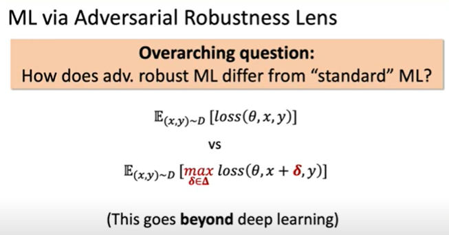

# Adversarial ML

> ML / Adversarial Robustness

https://adversarial-ml-tutorial.org/

- Tutorial Video https://www.youtube.com/watch?v=TwP-gKBQyic

 

- find adversarial examples, and optimize from them.

- Good result, but same attack method and training method.

- how to scale (not simple NNIST) is still open problem.

- https://adversarial-ml-tutorial.org

- https://gradientscience.org

  