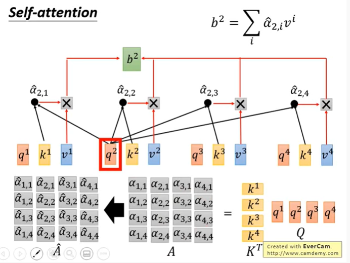
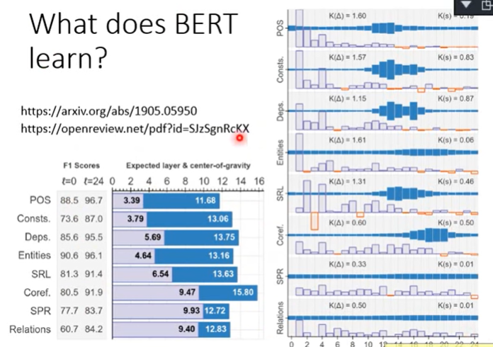

# NLP

> NLP / Transformer

## [RES] Videos

Attention is All you need

https://www.youtube.com/watch?v=iDulhoQ2pro&ab_channel=YannicKilcher

Bert Explained!

https://www.youtube.com/watch?v=OR0wfP2FD3c&ab_channel=HenryAILabs

LSTM is dead. Long Live Transformers

https://www.youtube.com/watch?v=S27pHKBEp30

Pytorch Transformers from Scratch

https://www.youtube.com/watch?v=U0s0f995w14

## [RES] Pages

The Illustrated Transformer

http://jalammar.github.io/illustrated-transformer/

BERT Explained - A list of frequent asked questions

https://yashuseth.blog/2019/06/12/bert-explained-faqs-understand-bert-working/

[Quora] Are transformers (BERT, etc.) one kind of embedding (word vectors)?

https://www.quora.com/Are-transformers-BERT-etc-one-kind-of-embedding-word-vectors

[Wikipedia] Transformer

https://en.wikipedia.org/wiki/Transformer_(machine_learning_model)

Transformer Neural Network Architecture (a summary)

https://devopedia.org/transformer-neural-network-architecture

## Attention is All you need

## BERT Explained!

## LSTM is dead. Long Live Transformers

- https://github.com/huggingface/transformers
  - both PyTorch and TensorFlow
  - Pre-trained models
  - Easy to fine-tune

References
LSTM paper (scanned from stone tablets): https://www.bioinf.jku.at/publications/older/2604.pdf
LSTM diagrams, and a great deep dive: https://colah.github.io/posts/2015-08-Understanding-LSTMs/
Attention is all you need: https://arxiv.org/abs/1706.03762
Attention illustrated: https://towardsdatascience.com/attn-illustrated-attention-5ec4ad276ee3
BERT: https://arxiv.org/abs/1810.04805
ELMo: https://arxiv.org/pdf/1802.05365.pdf
Pre-trained transformer library: https://github.com/huggingface/transformers

## Illustrated Guide to Transformers Neural Network: A step by step explanation

https://www.youtube.com/watch?v=4Bdc55j80l8

## Pytorch Transformers from Scratch

https://www.youtube.com/watch?v=U0s0f995w14

## 吴恩达 Sequence Models (C5W3L07 Attention Model Intuition)(C5W3L08 Attention Model)

https://www.youtube.com/watch?v=SysgYptB198&list=PLkDaE6sCZn6F6wUI9tvS_Gw1vaFAx6rd6&index=4

https://www.youtube.com/watch?v=quoGRI-1l0A&list=PLkDaE6sCZn6F6wUI9tvS_Gw1vaFAx6rd6&index=5

## (Hung-yi Lee) Transformer

https://www.youtube.com/watch?v=ugWDIIOHtPA

 

## (Hung-yi Lee) ELMO, BERT, GPT (Putting words into computers)

https://www.youtube.com/watch?v=UYPa347-DdE

多层的RNN会突出多个embedding，最终的embedding是$\alpha_i$加权之和，所加的权重是和目标任务一起学习出来。

两种approach一起使用。

## Text Preprocessing | Sentiment Analysis with BERT using huggingface, PyTorch and Python Tutorial

