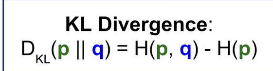

# Deep Learning 有关概念

> Deep Learning

## Model Selection and Train/Validation/Test set

https://www.youtube.com/watch?v=MyBSkmUeIEs

## Backpropagation

- What is backpropagation really doing? (3Blue1Brown)

  https://www.youtube.com/watch?v=Ilg3gGewQ5U&list=PLZHQObOWTQDNU6R1_67000Dx_ZCJB-3pi&index=3

- calculus (3Blue1Brown)

  https://www.youtube.com/watch?v=tIeHLnjs5U8

## Dropout

- Understanding Dropout Deeplearning.ai

  https://www.youtube.com/watch?v=ARq74QuavAo

Dropout is a regulation technique, but will cause the loss no longer well defined.

Suggestion: turn off dropout to see if loss decreasing, and add dropout back.

## Cross-Entropy = Entropy + KL Divergence

https://www.youtube.com/watch?v=ErfnhcEV1O8

**Why do we need cross entropy loss? (Visualized)**

https://www.youtube.com/watch?v=gIx974WtVb4

##  Softmax Regression (for multi-class)

https://www.youtube.com/watch?v=LLux1SW--oM

## 45 Questions to test a data scientist on basics of Deep Learning (along with solution)

- https://www.analyticsvidhya.com/blog/2017/01/must-know-questions-deep-learning/

## Gradient Descent, Step by Step

- https://www.youtube.com/watch?v=sDv4f4s2SB8
- 
- 计算intercept的微分时，带入别的值，得到f(intercept)

​			0.1是learning rate

