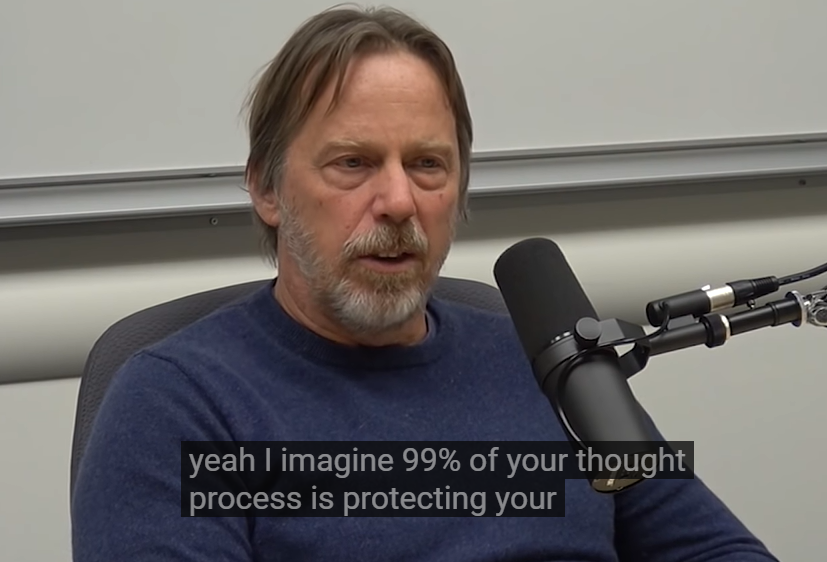
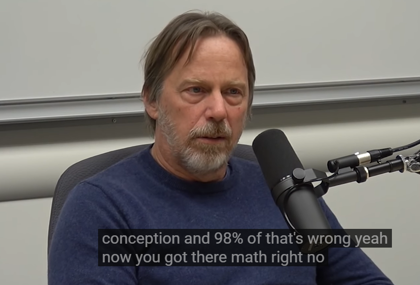
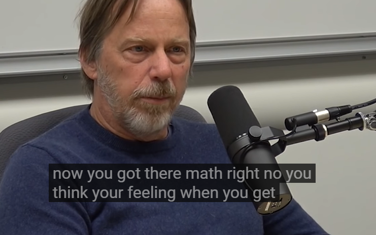
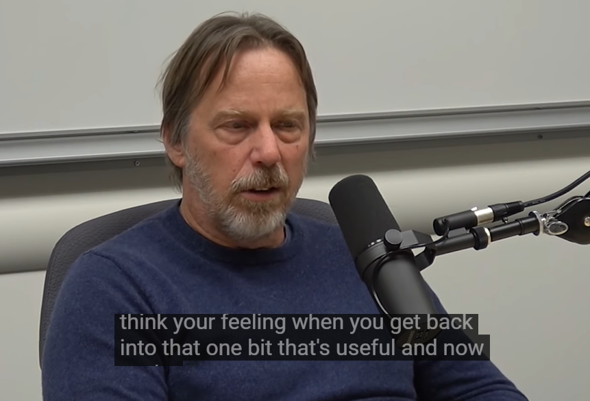

# 2333 666

> talks

How to have a bad career, David Patterson

https://www.youtube.com/watch?v=Rn1w4MRHIhc&feature=youtu.be

Patterson不同意Jim Keller关于摩尔定律的说法，并认为CS PhD们要意识到摩尔定律变慢给软件带来的问题。

Disagreement With Jim Keller About Moore's Law (David Patterson) | AI Podcast Clips with Lex Fridman

**Jim Keller: Moore’s Law is Not Dead**

https://www.youtube.com/watch?v=oIG9ztQw2Gc

**Jim Keller: Moore's Law, Microprocessors, and First Principles**

protecting yourself

