# NFV

> NFV / Xen / Click / ClickOS

## Paravirtualization

https://en.wikipedia.org/wiki/Paravirtualization

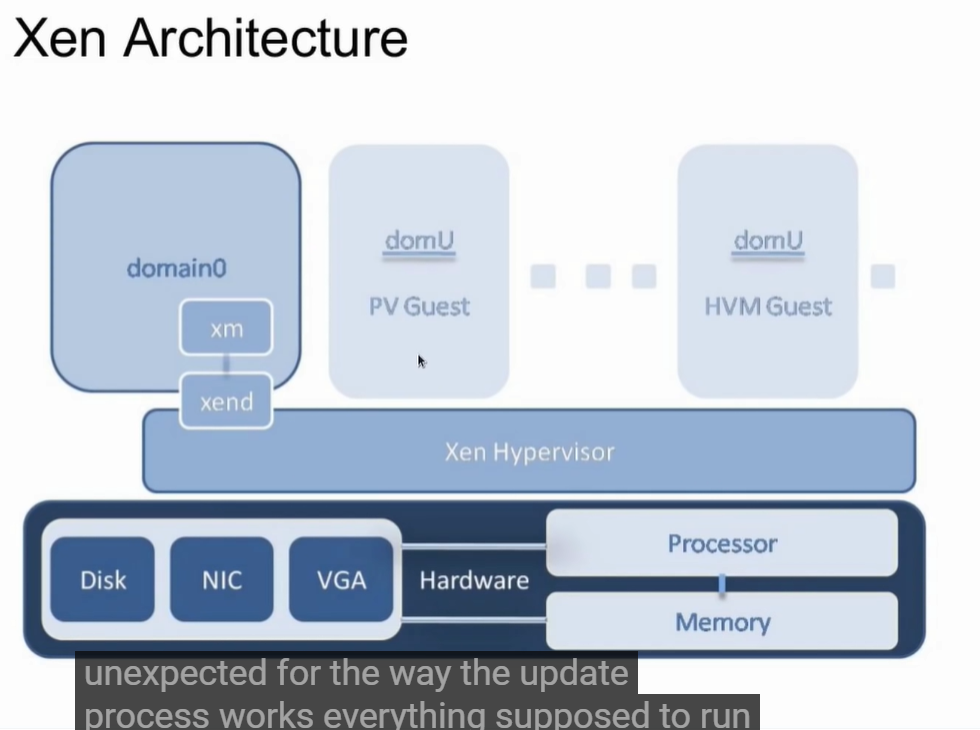

## LAN和VLAN区别和原理

https://www.jianshu.com/p/bcc4feffc5d6

## What is Xen Project / XCP NG Server Open Source Projects and How It All Works Together

https://www.youtube.com/watch?v=hh1QADop_IY

## What is Ethernet?

https://www.youtube.com/watch?v=HLziLmaYsO0

## Network Basics

Networking basics (2020) | What is a switch, router, gateway, subnet, gateway, firewall & DMZ

https://www.youtube.com/watch?v=_IOZ8_cPgu8

Virtualization: Bridged, NAT, Host-only - Virtual machine connection types

https://www.youtube.com/watch?v=XCkKDWMYHME

Bridge，适合做server

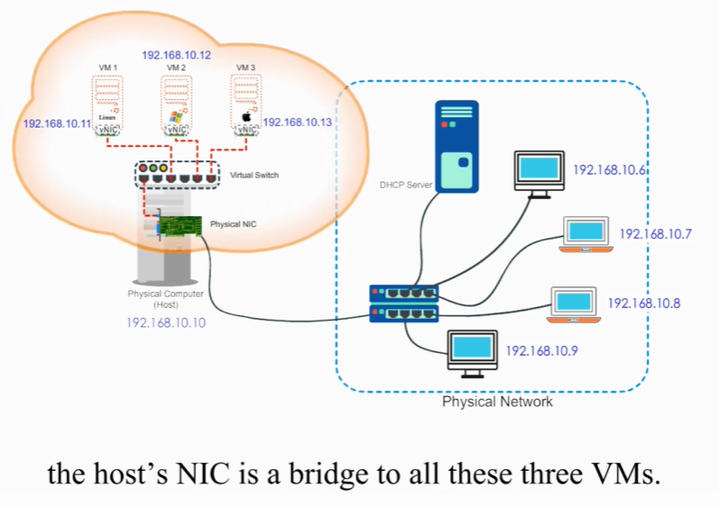

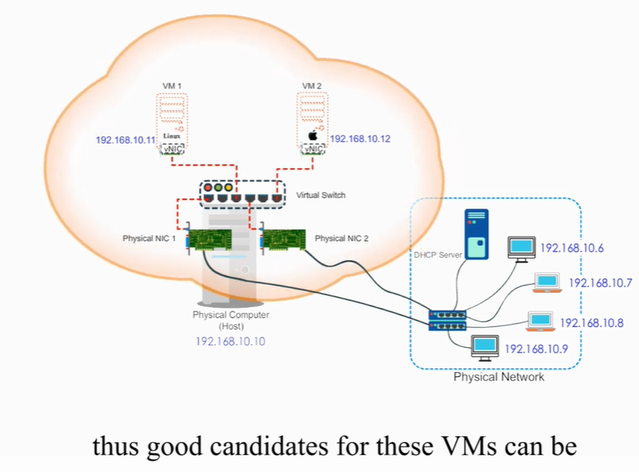

NAT，适合client only

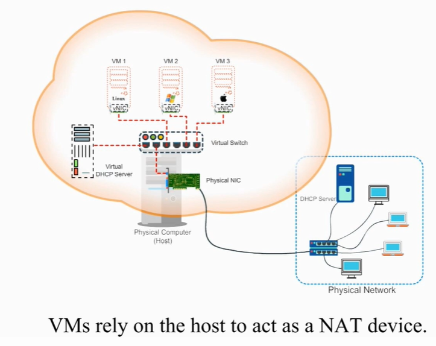

## GNS3

GNS3 Talks: Docker, Open vSwitch, SDN and OpenFlow Part 1: GNS3 Switching Part 7

https://www.youtube.com/watch?v=HdntvE0Nn-c&list=PLhfrWIlLOoKO_-1ujME74HteDNnc8CmGR

## NFV deployment

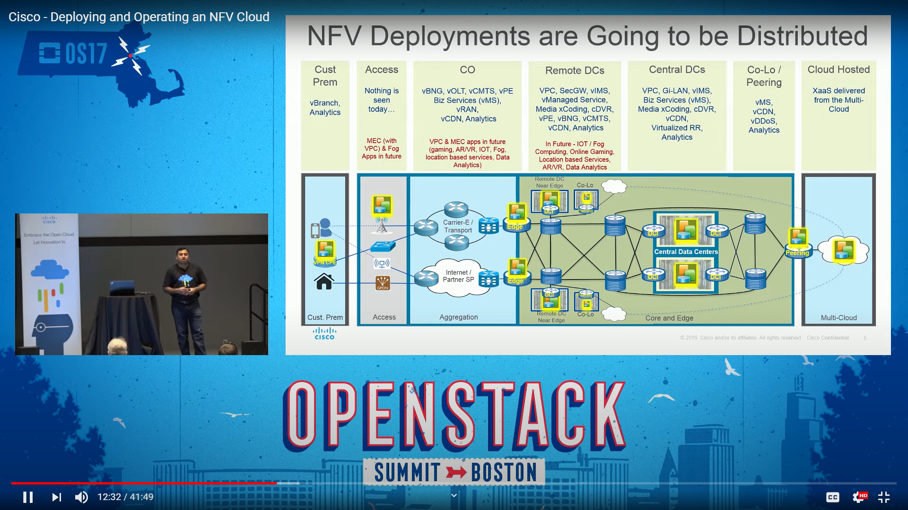

https://www.youtube.com/watch?v=hZ5G7641HfA

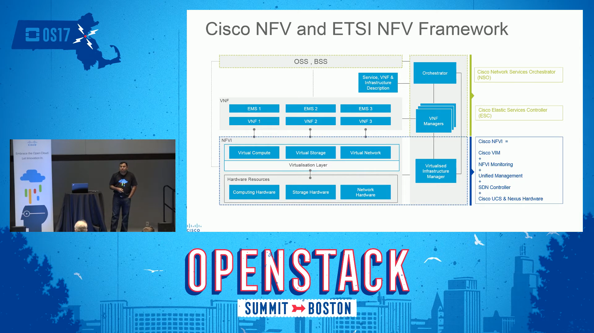

## NFV应用：vCPE

https://en.wikipedia.org/wiki/Customer-premises_equipment

客户驻地设备

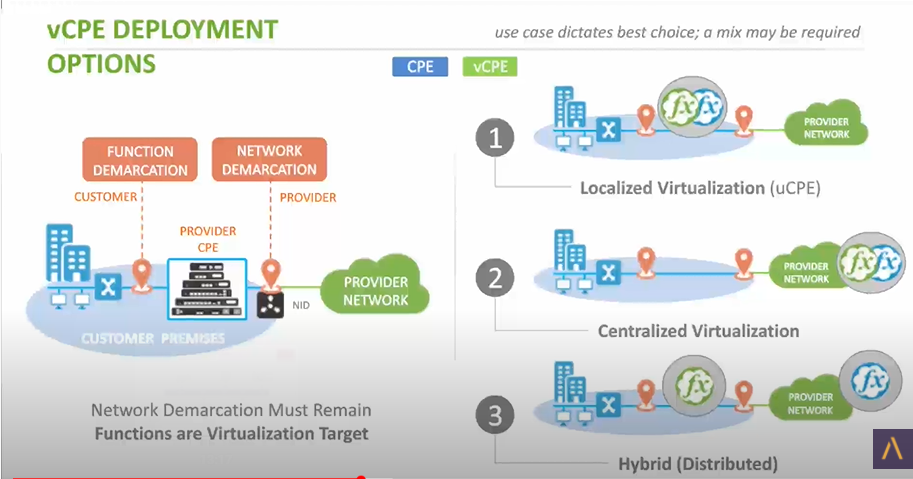

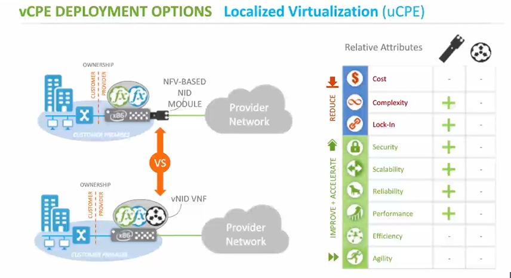

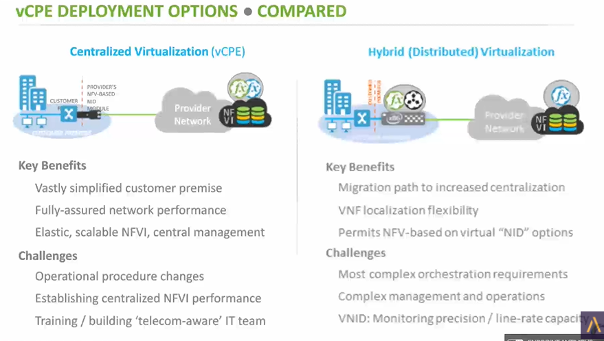

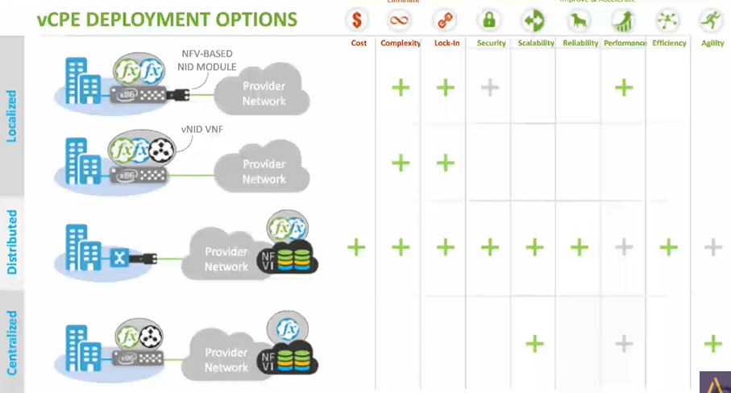

## Control Plane vs Data Plane | The Ancient Soldier

https://www.youtube.com/watch?v=P9ZMugAf9lU

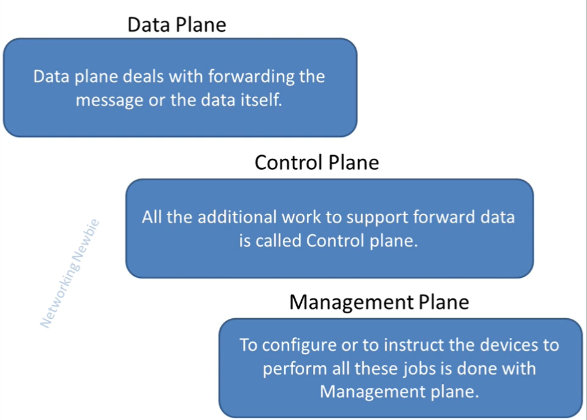