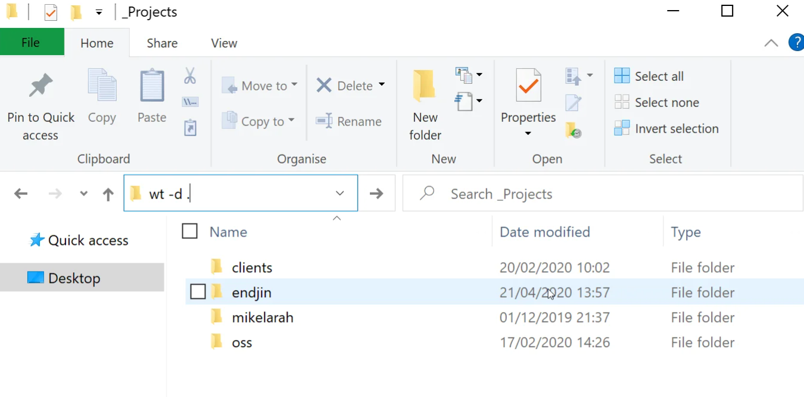

# Windows Terminal

> Windows / terminal / tools

- 5 tips for an awesome Windows Terminal experience
  - https://endjin.com/blog/2020/05/5-tips-for-an-awesome-windows-terminal-experience#open-the-terminal-at-the-current-directory

在当前目录打开windows terminal

alt+shift+=，左右分割窗口。

alt+shift+-，上下分割窗口。