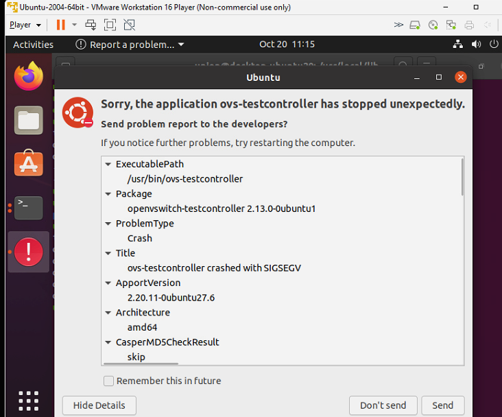
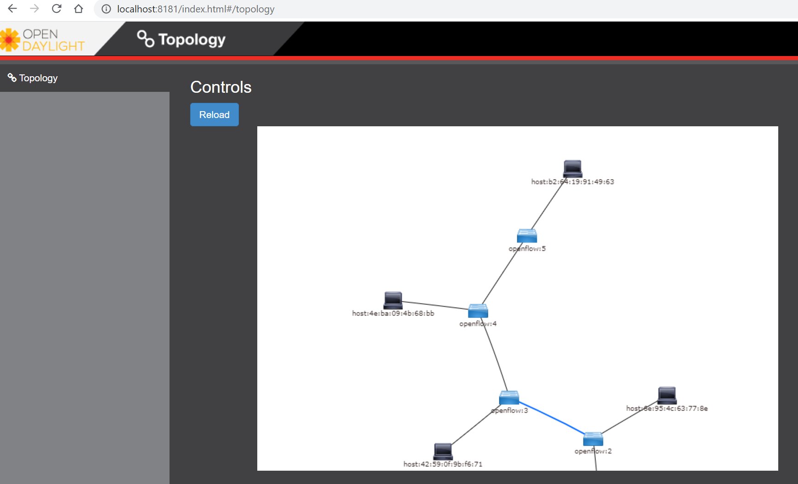
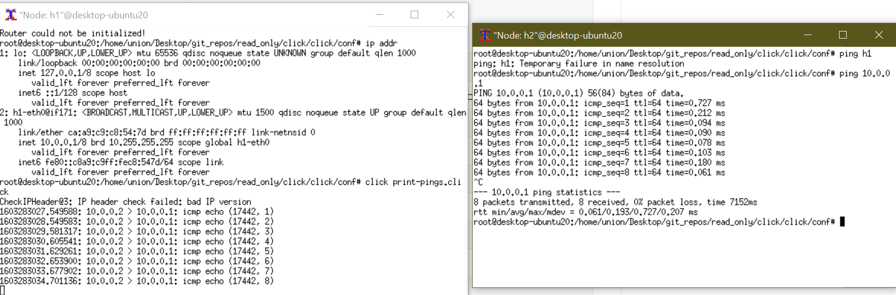
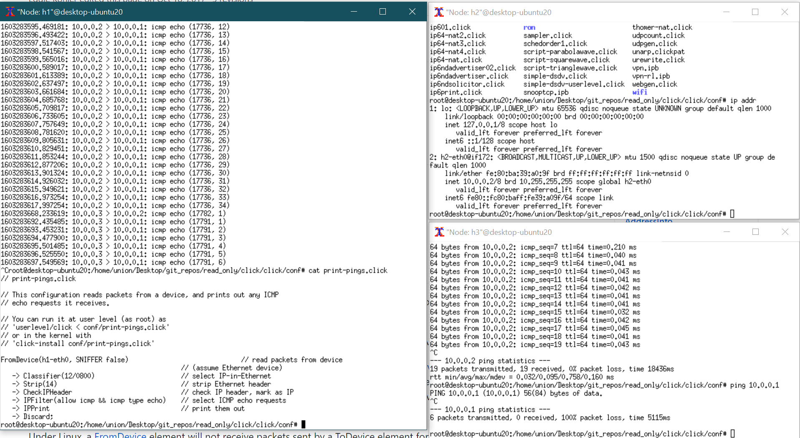
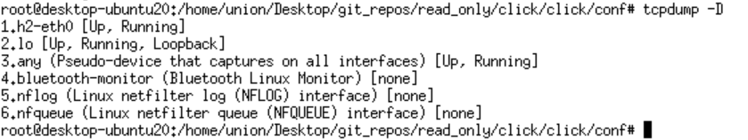
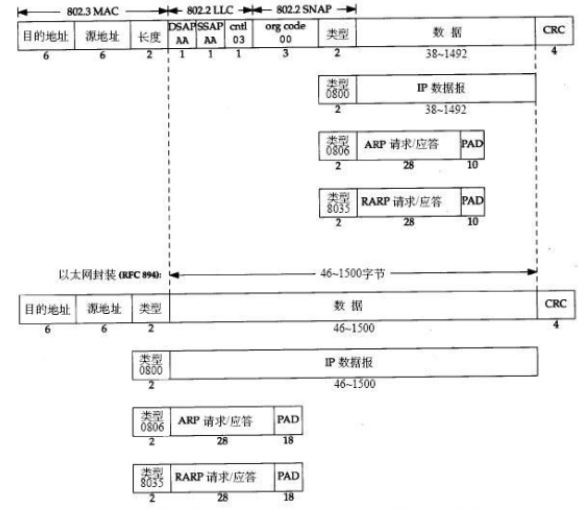

# mininet

> SDN / Tutorial

**mininet walkthrough** http://mininet.org/walkthrough/#display-startup-options

## 运行wireshark

在远程linux上设置DISPLAY变量到本地(windows)

## 关于openvswitch

系统似乎已经安装了open-vswitch

```
openvswitch-common/focal,now 2.13.0-0ubuntu1 amd64 [installed,auto-removable]
openvswitch-switch/focal,now 2.13.0-0ubuntu1 amd64 [installed,auto-removable]
```
按照mininet的默认，还需要安装：
```
sudo apt-get install openvswitch-testcontroller
```
然后需要停掉之前运行在6653端口的ovs-testcontroller, `sudo fuser -k 6653/tcp`会提示错误，忽略。



但是安装这个之后pingall会不通。所以放弃这个controller，改用opendaylight。

## 安装opendaylight

https://www.brianlinkletter.com/using-the-opendaylight-sdn-controller-with-the-mininet-network-emulator/#:~:text=OpenDaylight%20%28ODL%29%20is%20a%20popular%20open-source%20SDN%20controller,a%20virtual%20SDN%20network%20for%20OpenDaylight%20to%20control.

安装0.8.4, 并安装ui

feature:install odl-l2switch-switch-ui

然后运行mininet，

如：```sudo mn --topo linear,5 --controller=remote,ip=127.0.0.1,port=6633```

之后在浏览器打开localhost:8181



## 也可以用beacon

https://openflow.stanford.edu/display/Beacon/Releases.html

## Install Click

clone the latest, which fixed for linux kernel 5.2.

ToHostSniffers和PollDevice在userlevel不可用。

## 运行Click (print-pings.click)



- see https://github.com/kohler/click/wiki/FromDevice.u for FromDevice.u element (user level). note that it's different from https://github.com/kohler/click/wiki/FromDevice, which is the kernel version of FromDevice.

set SNIFFER to false, and in h1, packages will not go through kernel, p3 can ping p2 but cannot ping p1(timeout). 



- ToDump FromDump FromTcpdump available at userlevel.
- tcpdump -D to see all available capture interfaces:
- 

- tcpdump -L to see available data link types:

  ```
  # tcpdump -L
  Data link types for enp0s3 (use option -y to set):
    EN10MB (Ethernet)
    DOCSIS (DOCSIS) (printing not supported)
  ```

- tcpdump official: https://www.tcpdump.org/
  
- a third-party git book: https://nanxiao.github.io/tcpdump-little-book/
  
- Click packet source elements include [**FromDevice**](https://github.com/kohler/click/wiki/FromDevice) and [**InfiniteSource**](https://github.com/kohler/click/wiki/InfiniteSource); packet sink elements include [**ToDump**](https://github.com/kohler/click/wiki/ToDump), [**ToDevice**](https://github.com/kohler/click/wiki/ToDevice), and [**Discard**](https://github.com/kohler/click/wiki/Discard) (when it is used as a pull element).

### In FAQ: How do I make a simple Click router configuration?

Edit and run conf/make-ip-conf.pl script to generate a full Click IP router

- how to add own element class:
  - https://github.com/kohler/click/wiki/FAQs-about-click#how-can-i-add-my-own-element-class-to-click

- Elements Documentation
  - https://github.com/kohler/click/wiki/Elements

## 数据链路层头部




## Click Elements

- Classifier https://github.com/kohler/click/wiki/Classifier

  - "offset/value", offset是十进制，value是hex。

- IPClassifier https://github.com/kohler/click/wiki/IPClassifier

  - ```
     IPClassifier(10.0.0.0/24 and syn,
                   10.0.0.0/24 and fin ack,
                   10.0.0.0/24 and tcp,
                   -);
    ```

  - ```
     IPClassifier(dst tcp port 8000 or 8080,
                   dst tcp port > 1023,
                   tcp);
    ```

- CheckIPHeader https://github.com/kohler/click/wiki/CheckIPHeader

- CheckTCPHeader https://github.com/kohler/click/wiki/CheckTCPHeader
- IPFilter https://github.com/kohler/click/wiki/IPFilter
  - Every IPFilter element has an equivalent corresponding [IPClassifier](https://github.com/kohler/click/wiki/IPClassifier) element and vice versa. Use the element whose syntax is more convenient for your needs.

- Print https://github.com/kohler/click/wiki/Print
- IPPrint https://github.com/kohler/click/wiki/IPPrint

## Switch 有IP吗

They can. It does not matter to them switching packets. But if you want to log in and configure the switch over IP (e.g. ssh or snmp), it needs an IP address.A better way to think of this is to consider the “switch” the part that passes packets from port A to port B. Think of the “supervisor”, the part you log into and sends SNMP traps, as a host with its very own special port inside the switch. Keeping these two things separate in your mind is important.

## Mininet的switch的ip addr奇怪

http://mininet.org/walkthrough/#everything-in-its-own-namespace-user-switch-only

**Everything in its own Namespace (user switch only)**

By default, the hosts are put in their own namespace, while switches and the controller are in the root namespace. To put switches in their own namespace, pass the `--innamespace` option:

```
$ sudo mn --innamespace --switch user
```

Instead of using loopback, the switches will talk to the controller through a separately bridged control connection. By itself, this option is not terribly useful, but it does provide an example of how to isolate different switches.

Note that this option does not (as of 11/19/12) work with Open vSwitch.