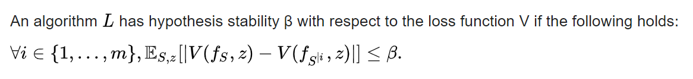
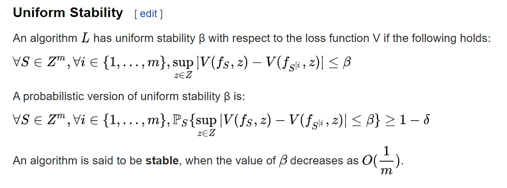

# Generalization bound @ ML

> ML / Generalization Bound / Stability

- Generalization error https://en.wikipedia.org/wiki/Generalization_error
- Stability (Learning Theory) https://en.wikipedia.org/wiki/Stability_(learning_theory)
  - also some stable algorithms are mentioned
- Generalization bounds https://mostafa-samir.github.io/ml-theory-pt2/

## Stability (Learning Theory)

It was shown that for large classes of learning algorithms, notably [empirical risk minimization](https://en.wikipedia.org/wiki/Empirical_risk_minimization) algorithms, certain types of stability ensure good generalization.

**Hypothesis Stability**

**Uniform Stability**

https://en.wikipedia.org/wiki/Stability_(learning_theory)

