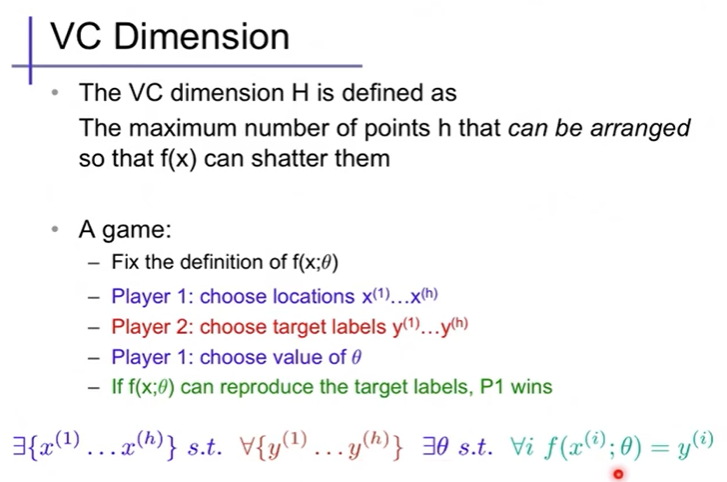
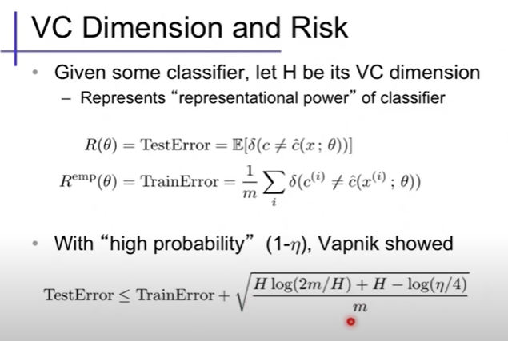

# VC Dimension

> VC Dimension

https://www.youtube.com/watch?v=puDzy2XmR5c

Model complexity control for regression using VC generalization bounds

https://pubmed.ncbi.nlm.nih.gov/18252610/

stackexchange: VC dimension of regression model

https://stats.stackexchange.com/questions/140430/vc-dimension-of-regression-models

Complete Statistical Theory of Learning (Vladimir Vapnik) | MIT Deep Learning Series

https://www.youtube.com/watch?v=Ow25mjFjSmg

Vladimir Vapnik: Statistical Learning | Lex Fridman Podcast #5

https://www.youtube.com/watch?v=STFcvzoxVw4&list=PLrAXtmErZgOdP_8GztsuKi9nrraNbKKp4&t=3147s