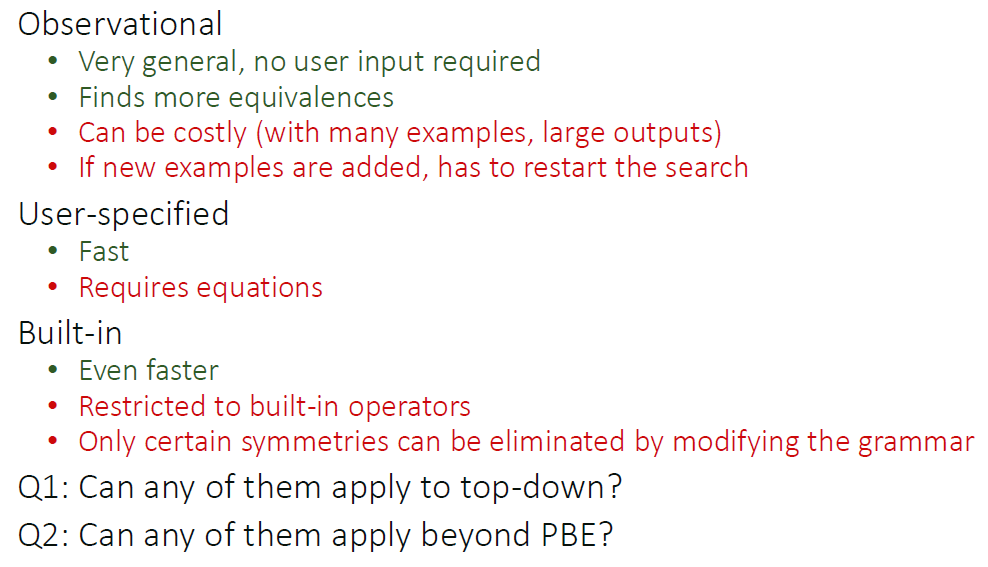
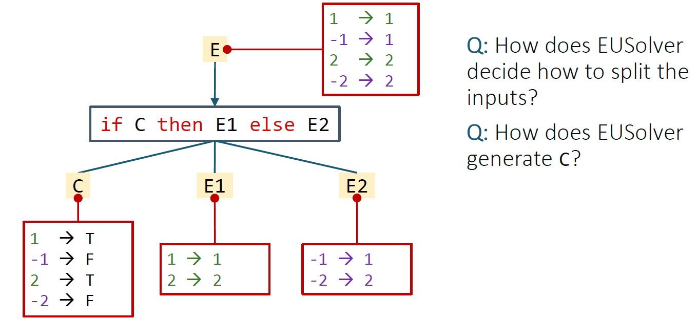
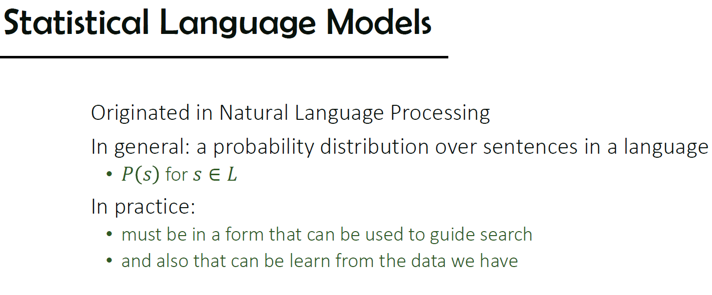
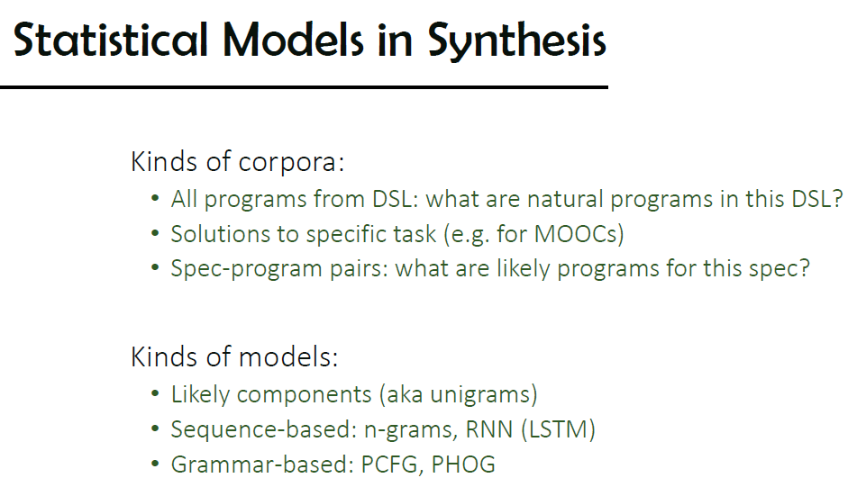
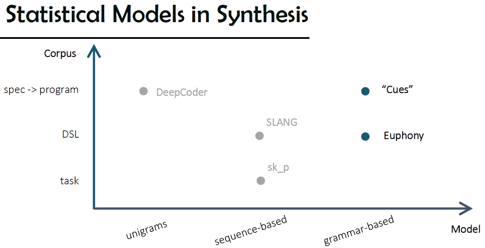
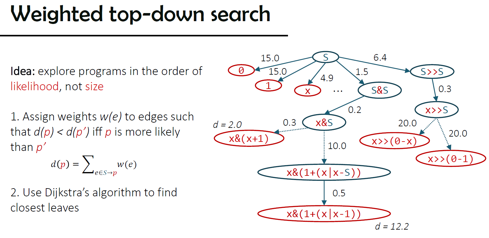
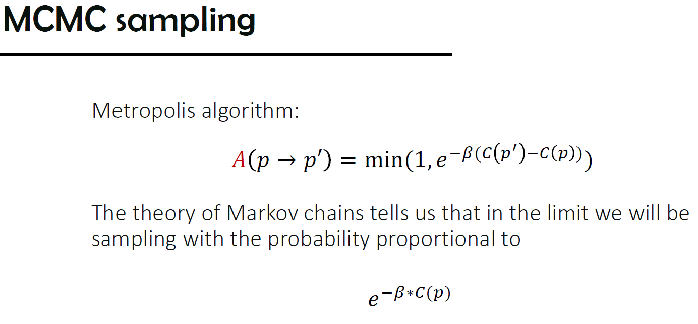
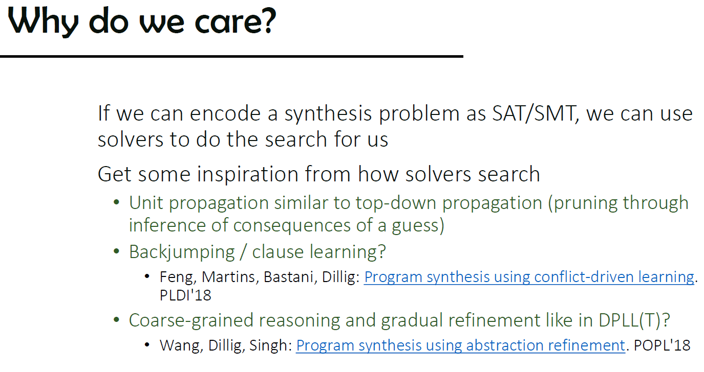

# CSE291 Program Synthesis (By Nadia Polikarpova)

> PL / Program Synthesis / Lecture Notes

## Lecture 01

Synthesis = an unusually concise / intuitive programming language + a compiler based on search

- Dimensions of program synthesis
  - Search strategy, 
  - behaviorial constraints (specification), 
  - structural constraints

## Lecture 03

Pruning techniques for enumerative search

- Equivalence reduction
  - equivalence: in general undecidable
  - observational equivalence
  - User-specifies equations (term-rewriting system)
  - built-in equivalences (attribute grammars, etc)
  - 
- Top-down specification propagation
  - works when function is injective https://en.wikipedia.org/wiki/Injective_function
- Condition abduction: smart ways to synthesize conditionals
  - 

## Lecture 4: Search Bias

explore programs in the order of **likelihood**, not **size**

- SLANG: autocompletion, good: fast, limitations: all invocation pairs must appear in training set

  

- Grammar-based models
  - weighted top-down search
  - from probabilistic grammars to weights
  - 

- A\* search

- Probabilistic CFG
- Probabilistic Higher-Order Grammar (PHOG)
  - Code completion, deobfuscation, programming language translation, statistical bug detection
  - Accelerating Search-Based Program Synthesis using Learned Probabilistic Models
    - https://www.cis.upenn.edu/~alur/PLDI18.pdf

## Lecture 5: Representation-based Search

build a graph that represents the search space, search in that graph (or not)

tradeoff: **easy to build** vs **easy to search**

Representations:

- Version Space Algebra (VSA)
- Finite Tree Automaton (FTA)
- Type Transition Net (TTN)

Enumerative unfolds the search space in time, while representation based stores it in memory

## Lecture 6: Stochastic Search

## Lecture 7: Introduction to SAT and SMT

